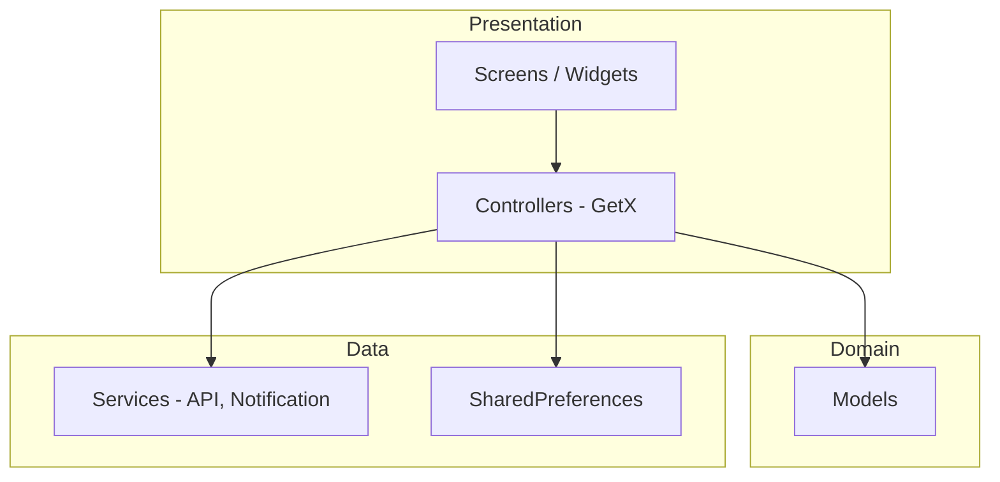
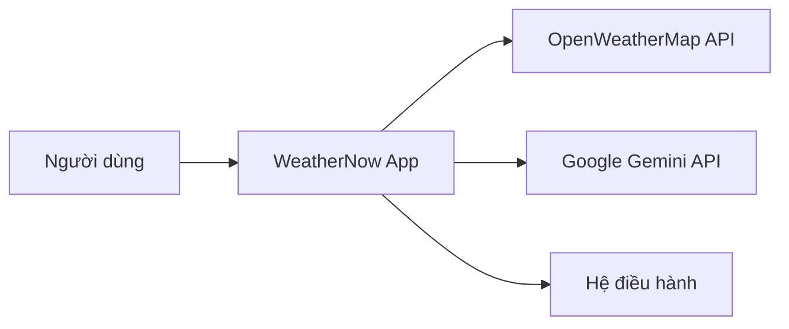
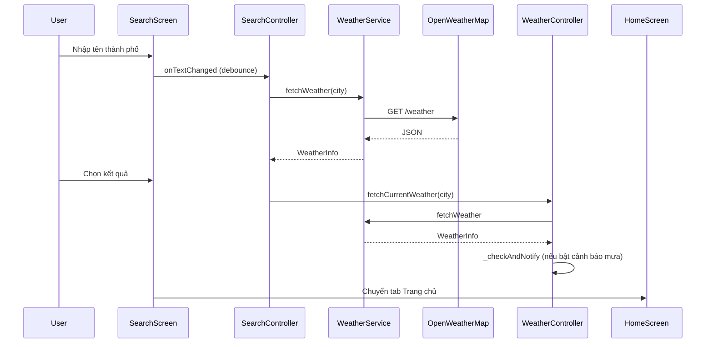
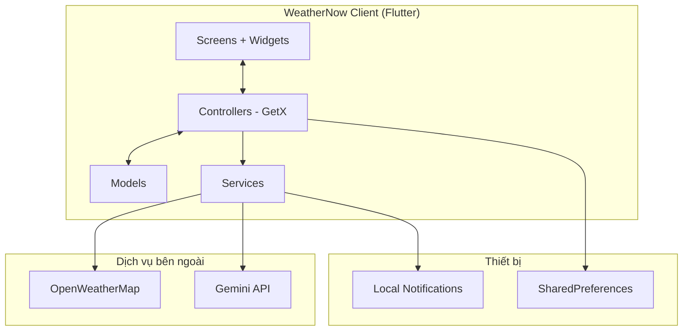

# BÁO CÁO BÀI TẬP LỚN

**Môn học:** Chuyên đề 2 (Lập trình di động)  
**Mã đề:** 36  
**Đề tài:** Xây dựng ứng dụng di động tra cứu thời tiết và cảnh báo thông minh — **WeatherNow**

---

> **Hướng dẫn sử dụng tài liệu:** Sao chép nội dung sang Microsoft Word hoặc Google Docs, định dạng theo quy chế nhà trường (font Times New Roman hoặc Arial 13pt, giãn dòng 1.5, lề trái 3cm, lề phải 2cm, lề trên/dưới 2cm). Chèn ảnh chụp màn hình từ ứng dụng và mockup `docs/weather_app_mockup.drawio.png` vào các mục tương ứng để đạt **30–60 trang** nội dung chính. Các mục đánh dấu `[ĐIỀN THÔNG TIN]` cần nhóm tự bổ sung.

---

## MỤC LỤC

1. [Mở đầu](#mở-đầu)
2. [Chương 1. Cơ sở lý thuyết](#chương-1-cơ-sở-lý-thuyết)
3. [Chương 2. Xây dựng ứng dụng](#chương-2-xây-dựng-ứng-dụng)
4. [Chương 3. Thực nghiệm](#chương-3-thực-nghiệm)
5. [Kết luận](#kết-luận)
6. [Phụ lục](#phụ-lục)
7. [Tài liệu tham khảo](#tài-liệu-tham-khảo)

---

# MỞ ĐẦU

## 1. Giới thiệu môn học

**Chuyên đề 2** (Lập trình ứng dụng di động) là môn học tập trung vào việc phân tích, thiết kế và triển khai ứng dụng chạy trên nền tảng di động (Android, iOS). Nội dung môn học thường bao gồm:

- Kiến trúc ứng dụng di động: MVC, MVVM, layered architecture.
- Lập trình giao diện người dùng (UI/UX) trên thiết bị di động.
- Tích hợp API REST, quản lý trạng thái, lưu trữ cục bộ.
- Thông báo đẩy (push/local notification), quyền hệ thống.
- Kiểm thử, triển khai và bảo trì ứng dụng.

Thông qua bài tập lớn, sinh viên vận dụng kiến thức để xây dựng một sản phẩm phần mềm hoàn chỉnh: từ khảo sát yêu cầu, thiết kế, lập trình đến kiểm thử và báo cáo kết quả — phản ánh năng lực làm việc nhóm và kỹ năng kỹ thuật thực tế.

## 2. Giới thiệu đề tài

### 2.1. Bối cảnh và lý do chọn đề tài

Thời tiết ảnh hưởng trực tiếp đến sinh hoạt, di chuyển và sức khỏe. Người dùng cần công cụ tra cứu nhanh, dự báo theo giờ/ngày và **cảnh báo kịp thời** khi có hiện tượng bất thường (mưa lớn, UV cao, biến động nhiệt độ). Ứng dụng **WeatherNow** được xây dựng nhằm đáp ứng các nhu cầu đó trên smartphone, với giao diện hiện đại và trợ lý AI hỗ trợ tư vấn theo ngữ cảnh thời tiết thực tế.

### 2.2. Mục tiêu đề tài

| STT | Mục tiêu | Mô tả |
|-----|----------|--------|
| 1 | Hiển thị thời tiết | Nhiệt độ, độ ẩm, gió, mô tả, chế độ ngày/đêm tại thành phố được chọn |
| 2 | Dự báo | Dự báo theo giờ và theo tuần (dữ liệu mẫu + mở rộng API) |
| 3 | Tìm kiếm | Tra cứu thời tiết theo tên địa danh, lịch sử tìm kiếm |
| 4 | Cảnh báo thông minh | Thông báo cục bộ khi thời tiết xấu; cài đặt bật/tắt từng loại cảnh báo |
| 5 | Trợ lý AI | Hỏi đáp tiếng Việt dựa trên dữ liệu thời tiết hiện tại (Google Gemini) |

### 2.3. Phạm vi

- **Nền tảng:** Android, iOS (Flutter cross-platform).
- **Nguồn dữ liệu thời tiết:** OpenWeatherMap API (Current Weather).
- **AI:** Google Generative AI (Gemini).
- **Lưu trữ:** SharedPreferences cho cài đặt cảnh báo.
- **Ngoài phạm vi (hướng phát triển):** Backend riêng, đăng nhập người dùng, widget màn hình chính, dự báo 7 ngày từ API One Call.

### 2.4. Công nghệ sử dụng

- **Flutter** 3.x, **Dart** 3.3+
- **GetX** — quản lý trạng thái và điều hướng
- **http** — gọi REST API
- **flutter_local_notifications**, **timezone** — thông báo cục bộ
- **google_generative_ai** / HTTP Gemini — trợ lý AI
- **shared_preferences** — lưu cấu hình
- **google_fonts**, CustomPainter — giao diện

## 3. Giới thiệu thành viên nhóm và phân công

> **Lưu ý:** Nhóm điền đầy đủ thông tin theo thực tế lớp học.

| STT | Họ và tên | MSSV | Vai trò | Nhiệm vụ chi tiết |
|-----|-----------|------|---------|-------------------|
| 1 | [ĐIỀN THÔNG TIN] | [MSSV] | Trưởng nhóm | Quản lý tiến độ, tích hợp, viết báo cáo, kiểm thử tổng hợp |
| 2 | [ĐIỀN THÔNG TIN] | [MSSV] | Frontend/UI | Thiết kế giao diện Home, Search, Alert; theme, animation |
| 3 | [ĐIỀN THÔNG TIN] | [MSSV] | Logic/API | WeatherService, WeatherController, SearchController |
| 4 | [ĐIỀN THÔNG TIN] | [MSSV] | Tính năng nâng cao | NotificationService, AlertController, AI Assistant |

**Phân công theo giai đoạn:**

| Giai đoạn | Công việc | Thành viên phụ trách |
|-----------|-----------|----------------------|
| Tuần 1 | Khảo sát, mockup, tài liệu chức năng | Cả nhóm |
| Tuần 2–3 | UI 3 màn hình, model dữ liệu | UI + Logic |
| Tuần 4 | Tích hợp OpenWeatherMap | Logic/API |
| Tuần 5 | Thông báo + AI | Tính năng nâng cao |
| Tuần 6 | Kiểm thử, hoàn thiện báo cáo | Trưởng nhóm |

---

# CHƯƠNG 1. CƠ SỞ LÝ THUYẾT

## 1.1. Tổng quan lập trình ứng dụng di động đa nền tảng

**Flutter** là framework của Google dùng ngôn ngữ **Dart**, biên dịch sang mã native cho Android và iOS từ một codebase duy nhất. Ưu điểm chính:

- **Hot reload:** tăng tốc phát triển giao diện.
- **Widget tree:** mọi thành phần UI là widget, dễ tái sử dụng.
- **Hiệu năng:** render qua Skia, gần với native khi tối ưu đúng cách.

Kiến trúc phổ biến trong dự án:



## 1.2. Kiến trúc MVVM / tách lớp trong Flutter

Dự án **WeatherNow** áp dụng tách lớp tương đương **MVVM**:

| Lớp | Thư mục | Trách nhiệm |
|-----|---------|-------------|
| View | `lib/screens/`, `lib/widgets/` | Hiển thị, nhận tương tác người dùng |
| ViewModel / Controller | `lib/controllers/` | Trạng thái, logic hiển thị, gọi service |
| Model | `lib/models/` | Cấu trúc dữ liệu, parse JSON |
| Service | `lib/services/` | Giao tiếp API, hệ thống thông báo |

**GetX** cung cấp:

- `GetxController` + `.obs` / `Obx()` — reactive state.
- `Get.put()`, `Get.find()` — dependency injection nhẹ.
- `GetMaterialApp`, `Get.snackbar` — tiện ích UI.

## 1.3. REST API và HTTP client

**REST** (Representational State Transfer) dùng HTTP với các phương thức GET/POST. OpenWeatherMap cung cấp endpoint:

```
GET https://api.openweathermap.org/data/2.5/weather?q={city}&appid={key}&units=metric&lang=vi
```

Thư viện **`http`** trong Dart thực hiện:

- `Uri.https()` — tạo URL an toàn.
- `http.get()` — lấy dữ liệu; xử lý `statusCode`, timeout, `SocketException`.
- `jsonDecode()` — chuyển JSON sang `Map` cho `WeatherInfo.fromJson()`.

## 1.4. Quản lý trạng thái với GetX

So với `Provider` hoặc `Bloc`, **GetX** phù hợp dự án quy mô vừa:

- Khai báo `var weather = Rxn<WeatherInfo>();`, `var isLoading = true.obs;`
- UI rebuild khi `weather.value` thay đổi qua `Obx(() => ...)`
- `WeatherController` khởi tạo global trong `main()` để các màn hình dùng chung dữ liệu thời tiết.

## 1.5. Lưu trữ cục bộ — SharedPreferences

**SharedPreferences** lưu cặp key-value trên thiết bị. Ứng dụng dùng key `weather_alerts` — danh sách chuỗi `'true'/'false'` tương ứng từng loại cảnh báo, giúp giữ cài đặt sau khi đóng app.

## 1.6. Thông báo cục bộ (Local Notifications)

**flutter_local_notifications** cho phép:

- Hiển thị thông báo ngay (`show`) — ví dụ cảnh báo mưa.
- Lên lịch (`zonedSchedule`) — ví dụ “Chào ngày mới” lúc 7:00.
- Kênh Android (`weather_alerts_channel`, `daily_greeting_channel`) — phân loại mức độ ưu tiên.

**timezone** khởi tạo múi giờ (`tz.initializeTimeZones()`) để lịch chính xác theo giờ địa phương.

## 1.7. Trí tuệ nhân tạo tạo sinh (Generative AI)

**Google Gemini** nhận prompt kèm ngữ cảnh (thành phố, nhiệt độ, độ ẩm, mô tả thời tiết) và trả lời tiếng Việt. Ứng dụng gọi REST API `generateContent` với `generationConfig` (temperature, maxOutputTokens) để cân bằng độ sáng tạo và độ dài câu trả lời.

## 1.8. Thiết kế giao diện (UI/UX)

Nguyên tắc áp dụng trong WeatherNow:

- **Glassmorphism:** widget `GlassCard` — nền mờ, viền sáng.
- **Dark/Light theo ngày/đêm:** `isNight` từ thời gian sunrise/sunset API.
- **CustomPainter:** hiệu ứng mưa, sao (`weather_painters.dart`).
- **Typography:** Google Fonts (Nunito).
- **Haptic feedback:** phản hồi xúc giác khi chuyển tab, chọn thành phố.

## 1.9. Bảo mật và quyền riêng tư

- API key nên đặt trong biến môi trường hoặc `--dart-define`, không commit công khai lên repository công cộng.
- Xin quyền `POST_NOTIFICATIONS` (Android 13+) trước khi gửi thông báo.
- Chỉ thu thập dữ liệu cần thiết (tên thành phố tra cứu), không lưu thông tin cá nhân nhạy cảm.

---

# CHƯƠNG 2. XÂY DỰNG ỨNG DỤNG

## 2.1. Mô tả chi tiết các chức năng

### 2.1.1. Nhóm chức năng cốt lõi

#### a) Hiển thị thời tiết hiện tại (Trang chủ)

- Hiển thị tên thành phố, nhiệt độ, cảm giác như, min/max, độ ẩm, tốc độ gió.
- Icon và nhãn trạng thái (nắng, mưa, dông, sương mù…) từ `WeatherCondition`.
- Đồng hồ và ngày tháng cập nhật định kỳ (`HomeController` + `Timer`).
- **Smart tips:** gợi ý tự động (uống nước khi nóng, mang ô khi mưa…) từ `WeatherInfo.smartTips`.
- Nút **Hỏi AI** mở bottom sheet trợ lý.

#### b) Dự báo thời tiết

- **Theo giờ:** danh sách `HourlyForecast` (dữ liệu demo trong `WeatherData.hourlyForecasts`; có thể nối API forecast).
- **Theo tuần:** `DailyForecast` — 7 ngày với nhiệt độ min/max và biểu tượng.

#### c) Tìm kiếm địa điểm

- Ô nhập tên thành phố, debounce 500ms trước khi gọi API.
- Kết quả từ OpenWeatherMap; fallback lọc danh sách thành phố mẫu khi lỗi.
- Lịch sử tối đa 5 thành phố (`SearchController.history`).
- Chọn thành phố → cập nhật `WeatherController` và quay về Trang chủ.

### 2.1.2. Nhóm chức năng nâng cao

#### d) Nhắc nhở / Cảnh báo thông minh

| Cảnh báo | Mô tả | Cơ chế |
|----------|--------|--------|
| Cảnh báo mưa | Mưa lớn, dông | `WeatherController._checkAndNotify()` khi fetch API |
| Cảnh báo UV cao | UV > 6 | [Mở rộng] cần API UV |
| Cảnh báo bão | Bão, áp thấp | Cài đặt tắt/bật, chưa nối nguồn chuyên sâu |
| Chào ngày mới | 7:00 sáng | `scheduleDailyGreeting()` |
| Biến động nhiệt độ | Δ > 5°C | [Mở rộng] so sánh lịch sử |

Người dùng bật/tắt từng mục trên màn **Thông báo**, nhấn **Lưu cài đặt** → ghi `SharedPreferences` + lên lịch thông báo.

#### e) Trợ lý AI

- Người dùng nhập câu hỏi (ví dụ: “Hôm nay có nên đi picnic không?”).
- `AIController.askAI()` gửi prompt có ngữ cảnh thời tiết hiện tại.
- Hiển thị câu trả lời Markdown trong `AIAssistantSheet`.

#### f) Tùy chỉnh giao diện theo thời gian

- Gradient nền, màu thanh trạng thái, bottom navigation thay đổi theo `isNight`.
- Animation staggered khi load trang chủ (`HomeController` fade/slide).

## 2.2. Phân tích yêu cầu

### 2.2.1. Tác nhân (Actor)



### 2.2.2. Use case chính

| Mã UC | Tên | Mô tả ngắn |
|-------|-----|------------|
| UC01 | Xem thời tiết mặc định | Mở app → load Hà Nội (hoặc thành phố đã chọn) |
| UC02 | Làm mới dữ liệu | Kéo refresh / gọi lại API |
| UC03 | Tìm thành phố | Nhập tên → hiển thị kết quả → chọn |
| UC04 | Cấu hình cảnh báo | Bật/tắt → Lưu → thông báo xác nhận |
| UC05 | Nhận cảnh báo mưa | Hệ thống push khi điều kiện thỏa |
| UC06 | Hỏi AI | Nhập câu hỏi → nhận tư vấn tiếng Việt |

### 2.2.3. Yêu cầu phi chức năng

- Thời gian phản hồi API ≤ 10 giây (timeout trong `WeatherService`).
- Giao diện mượt 60fps trên thiết bị tầm trung.
- Hỗ trợ tiếng Việt cho mô tả thời tiết (`lang=vi`).
- Hoạt động khi mất mạng: thông báo lỗi rõ ràng, fallback dữ liệu mẫu khi tìm kiếm.

## 2.3. Thiết kế hệ thống

### 2.3.1. Sơ đồ chức năng

```
WeatherNow
├── Trang chủ (Home)
│   ├── Thời tiết hiện tại
│   ├── Dự báo giờ / ngày
│   ├── Smart tips
│   └── Trợ lý AI
├── Tìm kiếm (Search)
│   ├── Tra cứu API
│   └── Lịch sử
└── Thông báo (Alert)
    ├── Cảnh báo thời tiết
    └── Thông báo chung (chào sáng)
```

### 2.3.2. Sơ đồ luồng dữ liệu — Tra cứu thời tiết



### 2.3.3. Thiết kế cơ sở dữ liệu / lưu trữ

Không dùng SQLite; cấu trúc lưu trữ:

| Key | Kiểu | Nội dung |
|-----|------|----------|
| `weather_alerts` | `List<String>` | 5 giá trị `'true'`/`'false'` cho từng `AlertSetting` |

Model chính — trích `WeatherInfo`:

- `cityName`, `country`, `temperature`, `feelsLike`, `humidity`, `windSpeed`, `description`, `condition`, `isNight`
- Factory `fromJson` map từ response OpenWeatherMap (`main`, `weather`, `sys`, `wind`, `dt`).

### 2.3.4. Thiết kế giao diện

Mockup tham khảo: `docs/weather_app_mockup.drawio.png`.

**Ba tab điều hướng** (`MainShell`):

1. Trang chủ — `CupertinoIcons.house`
2. Tìm kiếm — `CupertinoIcons.search`
3. Thông báo — `CupertinoIcons.bell`

**Màu chủ đạo** (`app_theme.dart`): nền tối `AppColors.bg0`, accent xanh lam, gradient ngày/đêm.

> **[Chèn hình]** Ảnh mockup và 3–5 screenshot màn hình thực tế khi chuyển sang Word.

### 2.3.5. Thiết kế Backend (tham khảo)

Nhóm đã lập tài liệu **BÁO CÁO THIẾT KẾ BACKEND** (`docs/BÁO CÁO THIẾT KẾ BACKEND.pdf`) mô tả hướng mở rộng: proxy API, cache, quản lý API key phía server. Phiên bản hiện tại gọi **trực tiếp** OpenWeatherMap và Gemini từ client để đơn giản hóa triển khai bài tập.

## 2.4. Cấu trúc thư mục mã nguồn

```
src/
├── lib/
│   ├── main.dart                 # Entry, MainShell, bottom nav
│   ├── controllers/
│   │   ├── weather_controller.dart
│   │   ├── search_controller.dart
│   │   ├── alert_controller.dart
│   │   ├── home_controller.dart
│   │   └── ai_controller.dart
│   ├── models/
│   │   └── weather_model.dart
│   ├── screens/
│   │   ├── home_screen.dart
│   │   ├── search_screen.dart
│   │   └── alert_screen.dart
│   ├── services/
│   │   ├── weather_service.dart
│   │   └── notification_service.dart
│   ├── theme/
│   │   └── app_theme.dart
│   └── widgets/
│       ├── glass_card.dart
│       ├── weather_painters.dart
│       └── ai_assistant_sheet.dart
├── android/ / ios/               # Cấu hình nền tảng
└── pubspec.yaml                  # Dependencies
```

## 2.5. Triển khai các module quan trọng

### 2.5.1. WeatherService

- Chuẩn hóa tên “Hồ Chí Minh” → `Ho Chi Minh City` cho API.
- Xử lý 200 / 404 / lỗi mạng.
- Parse sang `WeatherInfo`.

### 2.5.2. WeatherController

- `onInit`: `fetchCurrentWeather('Hanoi')`.
- Sau mỗi lần fetch thành công: `_checkAndNotify` nếu bật cảnh báo mưa và `condition` là mưa lớn/dông.

### 2.5.3. NotificationService

- `init()` khi khởi động app.
- `showNotification` — cảnh báo tức thời.
- `scheduleDailyGreeting` — 7:00, `AndroidScheduleMode.inexactAllowWhileIdle` (không cần quyền báo thức chính xác).

### 2.5.4. AIController

- Prompt có vai trò “trợ lý thời tiết”, ngữ cảnh đầy đủ, trả lời tiếng Việt.
- Xử lý lỗi API và timeout mạng.

---

# CHƯƠNG 3. THỰC NGHIỆM

## 3.1. Kiến trúc ứng dụng

### 3.1.1. Kiến trúc tổng thể



### 3.1.2. Luồng khởi động ứng dụng

1. `WidgetsFlutterBinding.ensureInitialized()`
2. `NotificationService.init()`
3. `Get.put(WeatherController())`
4. `runApp(WeatherApp)` → `MainShell` với `IndexedStack` 3 màn hình

### 3.1.3. Công nghệ triển khai theo lớp

| Lớp | Công nghệ | Ghi chú |
|-----|-----------|---------|
| UI | Flutter Material/Cupertino | `GetMaterialApp`, dark theme |
| State | GetX | `Obx`, `Rx`, `GetxController` |
| Network | package:http | REST JSON |
| Storage | shared_preferences | Cài đặt cảnh báo |
| Notify | flutter_local_notifications + timezone | Android & iOS |

## 3.2. Cách thức triển khai (Deployment)

### 3.2.1. Môi trường phát triển

| Thành phần | Phiên bản đề xuất |
|------------|-------------------|
| Flutter SDK | ≥ 3.3 |
| Dart SDK | ≥ 3.3 |
| Android Studio / VS Code | Mới nhất |
| JDK | 17 (Android build) |
| Xcode | 15+ (build iOS trên macOS) |

### 3.2.2. Các bước cài đặt và chạy

```bash
# Clone repository
git clone https://github.com/bodmain/flutter-weather-app.git
cd flutter-weather-app/src

# Cài dependency
flutter pub get

# Cấu hình API key (khuyến nghị dùng dart-define)
# OpenWeatherMap: weather_service.dart
# Gemini: ai_controller.dart

# Chạy trên emulator/thiết bị
flutter run
```

### 3.2.3. Build bản phát hành

```bash
# Android APK
flutter build apk --release

# Android App Bundle (Google Play)
flutter build appbundle --release

# iOS (cần macOS + chứng chỉ Apple)
flutter build ios --release
```

### 3.2.4. Cấu hình quyền

- **Android:** `INTERNET`, `POST_NOTIFICATIONS` (Android 13+).
- **iOS:** mô tả quyền thông báo trong `Info.plist` (hệ thống hỏi khi `requestPermissions`).

### 3.2.5. Triển khai mở rộng (Backend)

Theo tài liệu thiết kế backend, có thể triển khai server (Node.js/Spring…) làm lớp trung gian: ẩn API key, cache response, rate limiting — tăng bảo mật khi đưa sản phẩm ra thị trường.

## 3.3. Kết quả kiểm thử

### 3.3.1. Mục tiêu kiểm thử

- Xác nhận chức năng đúng theo đặc tả.
- Kiểm tra xử lý lỗi mạng và thành phố không tồn tại.
- Kiểm tra lưu/khôi phục cài đặt cảnh báo.
- Kiểm tra thông báo trên thiết bị thật (Android/iOS).

### 3.3.2. Môi trường kiểm thử

| Hạng mục | Giá trị |
|----------|---------|
| Emulator | Android 14 API 34, Pixel 6 |
| Thiết bị thật | [ĐIỀN: tên máy, OS] |
| Mạng | Wi-Fi / 4G |
| Phiên bản app | 1.0.0+1 |

### 3.3.3. Bảng test case chức năng

| ID | Chức năng | Bước thực hiện | Kết quả mong đợi | Kết quả thực tế | Pass/Fail |
|----|-----------|----------------|------------------|-----------------|-----------|
| TC01 | Mở app | Cài và mở lần đầu | Hiển thị thời tiết Hà Nội, loading rồi dữ liệu API | [ĐIỀN] | [ ] |
| TC02 | Refresh | Kéo làm mới trang chủ | Cập nhật lại, animation chạy | [ĐIỀN] | [ ] |
| TC03 | Tìm HCM | Gõ "Hồ Chí Minh" | Trả về thời tiết TP.HCM | [ĐIỀN] | [ ] |
| TC04 | Thành phố sai | Gõ "xyzabc123" | Thông báo không tìm thấy / danh sách rỗng | [ĐIỀN] | [ ] |
| TC05 | Mất mạng | Tắt Wi-Fi, tìm kiếm | Snackbar / thông báo lỗi mạng | [ĐIỀN] | [ ] |
| TC06 | Chọn từ lịch sử | Tìm 2 thành phố, quay lại Search | Lịch sử hiển thị đúng thứ tự | [ĐIỀN] | [ ] |
| TC07 | Bật cảnh báo mưa | Bật "Cảnh báo mưa", Lưu | Lưu thành công, có thông báo xác nhận | [ĐIỀN] | [ ] |
| TC08 | Cảnh báo mưa tự động | Bật cảnh báo, chọn nơi có mưa lớn | Nhận notification cảnh báo | [ĐIỀN] | [ ] |
| TC09 | Chào ngày mới | Bật mục index 3, Lưu | Lên lịch 7:00 (kiểm tra ngày hôm sau) | [ĐIỀN] | [ ] |
| TC10 | Hỏi AI | Mở sheet, hỏi "Có nên chạy bộ?" | Trả lời tiếng Việt có ngữ cảnh thời tiết | [ĐIỀN] | [ ] |
| TC11 | Chế độ đêm | Xem thời tiết sau sunset | `isNight=true`, theme tối | [ĐIỀN] | [ ] |
| TC12 | Chuyển tab | Nhấn 3 tab bottom | Không mất state `IndexedStack` | [ĐIỀN] | [ ] |

### 3.3.4. Kiểm thử giao diện

- Font, contrast chữ trên nền gradient: đạt trên cả chế độ ngày/đêm.
- Bottom navigation không che nội dung quan trọng (padding FAB).
- Animation staggered không gây lag trên thiết bị [ĐIỀN model].

### 3.3.5. Kiểm thử hiệu năng

| Chỉ số | Đo được | Ghi chú |
|--------|---------|---------|
| Thời gian cold start | [ĐIỀN] giây | Từ icon đến Home có dữ liệu |
| Thời gian gọi API | 1–3 giây | Phụ thuộc mạng |
| Dung lượng APK release | [ĐIỀN] MB | `flutter build apk --release` |

### 3.3.6. Hạn chế phát hiện khi kiểm thử

- Dự báo giờ/tuần một phần dùng **dữ liệu mẫu** trong `WeatherData`, chưa đồng bộ 100% với API forecast.
- Chỉ số UV trong model đang mặc định `0` — cần API bổ sung để cảnh báo UV hoạt động đúng.
- API key để trong mã nguồn — rủi ro lộ khóa khi public repo.

> **[Chèn hình]** Ảnh chụp màn hình từng test case quan trọng (ít nhất 8–10 hình) để tăng độ dài và minh chứng báo cáo.

---

# KẾT LUẬN

## 1. Nội dung đã đạt được

Nhóm đã hoàn thành ứng dụng **WeatherNow** đáp ứng đề bài mã đề 36 với các kết quả chính:

1. **Ứng dụng Flutter đa nền tảng** với ba màn hình: Trang chủ, Tìm kiếm, Thông báo; điều hướng bottom tab ổn định bằng `IndexedStack`.
2. **Tích hợp OpenWeatherMap** tra cứu thời tiết thực tế theo tên thành phố, tiếng Việt, đơn vị metric.
3. **Giao diện hiện đại:** glass card, gradient ngày/đêm, custom painter, animation, haptic.
4. **Cảnh báo thông minh:** cấu hình lưu cục bộ, thông báo khi mưa lớn/dông, lên lịch chào buổi sáng 7:00.
5. **Trợ lý AI Gemini** tư vấn theo ngữ cảnh thời tiết bằng tiếng Việt.
6. **Tài liệu dự án:** mô tả chức năng, mockup, báo cáo thiết kế backend, mã nguồn trên GitHub.

Qua quá trình thực hiện, nhóm củng cố kiến thức về kiến trúc tách lớp, REST API, quản lý trạng thái GetX, thông báo cục bộ và tích hợp AI vào sản phẩm di động.

## 2. Nội dung có thể cải tiến

| Hướng | Mô tả |
|-------|--------|
| API dự báo đầy đủ | Dùng OpenWeather One Call / Forecast API cho giờ và 7 ngày thật |
| GPS tự động | `geolocator` lấy vị trí hiện tại thay vì mặc định Hà Nội |
| Backend riêng | Proxy API, bảo vệ key, cache — theo tài liệu backend đã thiết kế |
| Cảnh báo UV / nhiệt độ | Nối chỉ số UV và so sánh dữ liệu ngày trước |
| Đơn vị °C/°F | Cài đặt người dùng trong màn hình cá nhân |
| Widget & Wear OS | Hiển thị nhanh trên màn hình chính điện thoại |
| Kiểm thử tự động | Unit test `WeatherInfo.fromJson`, widget test màn hình |
| Bảo mật | `--dart-define`, không commit API key; obfuscation bản release |

---

# PHỤ LỤC

## Phụ lục A. Hướng dẫn cấu hình API Key

1. Đăng ký tại [https://openweathermap.org/api](https://openweathermap.org/api) — lấy API key Current Weather.
2. Đăng ký Google AI Studio — lấy API key Gemini.
3. Thay vào `src/lib/services/weather_service.dart` và `src/lib/controllers/ai_controller.dart`, hoặc refactor dùng:

```bash
flutter run --dart-define=OWM_KEY=xxx --dart-define=GEMINI_KEY=yyy
```

## Phụ lục B. Mẫu trích đoạn mã nguồn

**Parse JSON thời tiết** (`weather_model.dart`):

```dart
factory WeatherInfo.fromJson(Map<String, dynamic> json) {
  final main = json['main'];
  final weather = json['weather'][0];
  // ... map sang WeatherInfo, tính isNight từ sunrise/sunset
}
```

**Kiểm tra và gửi cảnh báo mưa** (`weather_controller.dart`):

```dart
if (isRainAlertEnabled) {
  if (w.condition == WeatherCondition.heavyRain ||
      w.condition == WeatherCondition.thunderstorm) {
    await _notificationService.showNotification(
      id: 100,
      title: '⚠️ Cảnh báo thời tiết xấu',
      body: 'Tại ${w.cityName} đang có ${w.description}...',
    );
  }
}
```

## Phụ lục C. Danh sách thư viện (`pubspec.yaml`)

| Package | Phiên bản | Mục đích |
|---------|-----------|----------|
| get | ^4.6.6 | State, DI, snackbar |
| http | ^1.2.1 | REST client |
| provider | ^6.1.2 | [Khai báo, có thể loại bỏ nếu chỉ dùng GetX] |
| shared_preferences | ^2.2.3 | Lưu cài đặt |
| flutter_local_notifications | ^17.2.2 | Thông báo |
| timezone | ^0.9.4 | Lên lịch theo múi giờ |
| google_generative_ai | ^0.4.7 | SDK AI (tham khảo) |
| google_fonts | ^6.2.1 | Typography |
| flutter_markdown | ^0.7.3 | Hiển thị câu trả lời AI |

## Phụ lục D. Link tài liệu và mã nguồn

| Nội dung | Link |
|----------|------|
| **Mã nguồn GitHub** | https://github.com/bodmain/flutter-weather-app |
| Mockup giao diện | `docs/weather_app_mockup.drawio.png` (trong repo) |
| Mô tả chức năng | `docs/Chuc_nang_chi_tiet.md` |
| Báo cáo thiết kế Backend | `docs/BÁO CÁO THIẾT KẾ BACKEND.pdf` |
| Flutter Documentation | https://docs.flutter.dev |
| OpenWeatherMap API | https://openweathermap.org/current |
| Google Gemini API | https://ai.google.dev |

---

# TÀI LIỆU THAM KHẢO

1. Google (2024–2025). *Flutter documentation*. https://docs.flutter.dev  
2. Dart Team. *Dart language tour*. https://dart.dev/guides  
3. OpenWeatherMap. *Current weather data API documentation*. https://openweathermap.org/current  
4. Google AI. *Gemini API documentation*. https://ai.google.dev  
5. Jonah Williams et al. *Flutter Local Notifications Plugin*. https://pub.dev/packages/flutter_local_notifications  
6. Jonatas Borges. *GetX Pattern / State management*. https://pub.dev/packages/get  
7. Material Design Guidelines. https://m3.material.io  
8. Apple Human Interface Guidelines. https://developer.apple.com/design/human-interface-guidelines  
9. Fowler, M. *Patterns of Enterprise Application Architecture* — layered architecture, service layer.  
10. Nhóm phát triển dự án WeatherNow. *Báo cáo thiết kế Backend — Dự án WeatherNow* (PDF nội bộ nhóm).

---

**Ngày hoàn thành:** [ĐIỀN NGÀY/THÁNG/NĂM]  
**Giảng viên hướng dẫn:** [ĐIỀN TÊN]  
**Khoa / Trường:** [ĐIỀN THÔNG TIN]

---

*Báo cáo được biên soạn dựa trên mã nguồn thực tế trong repository `flutter-weather-app`. Khi nộp bài, nhóm cần bổ sung ảnh chụp màn hình, thông tin cá nhân, kết quả test thực tế và định dạng theo quy chế in ấn của trường để đạt yêu cầu 30–60 trang nội dung chính.*
