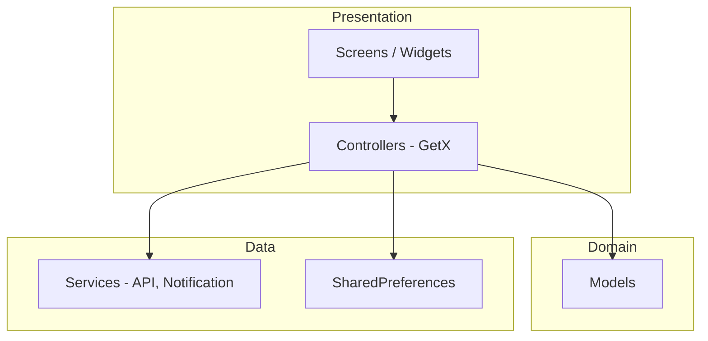
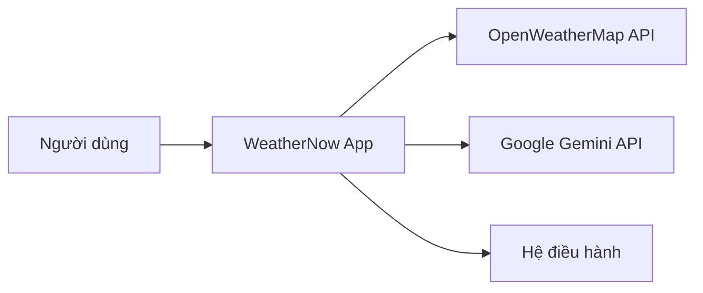
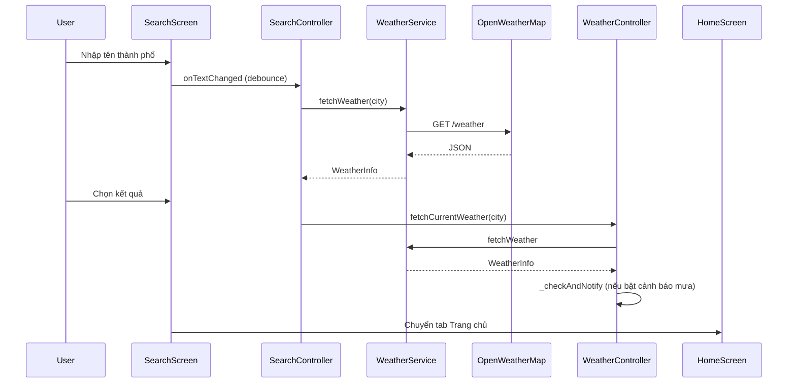
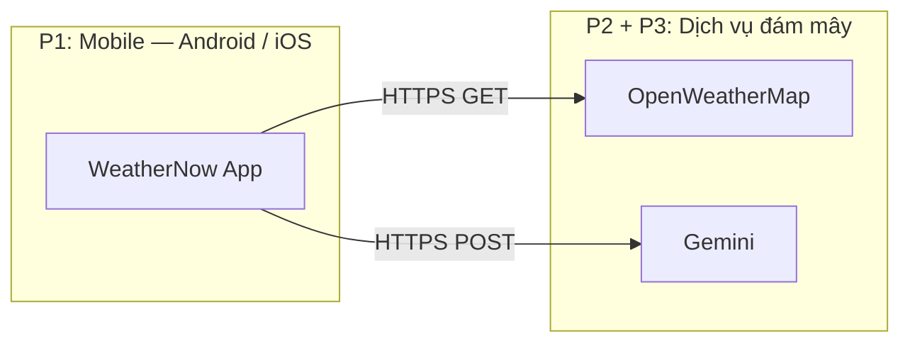
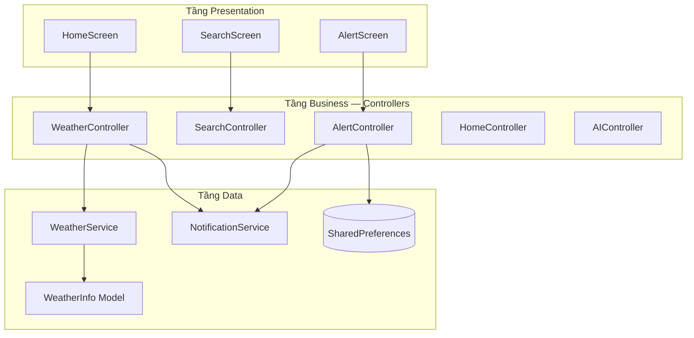
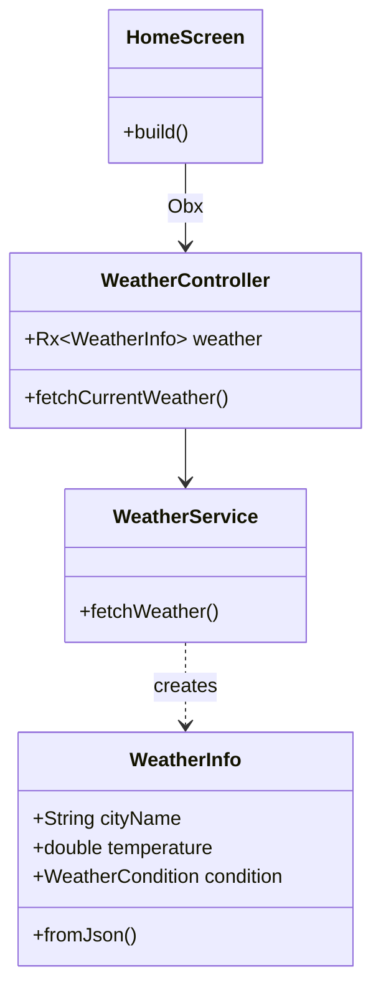
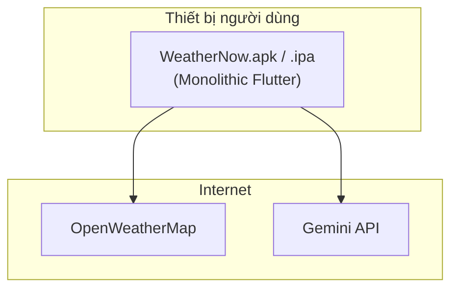
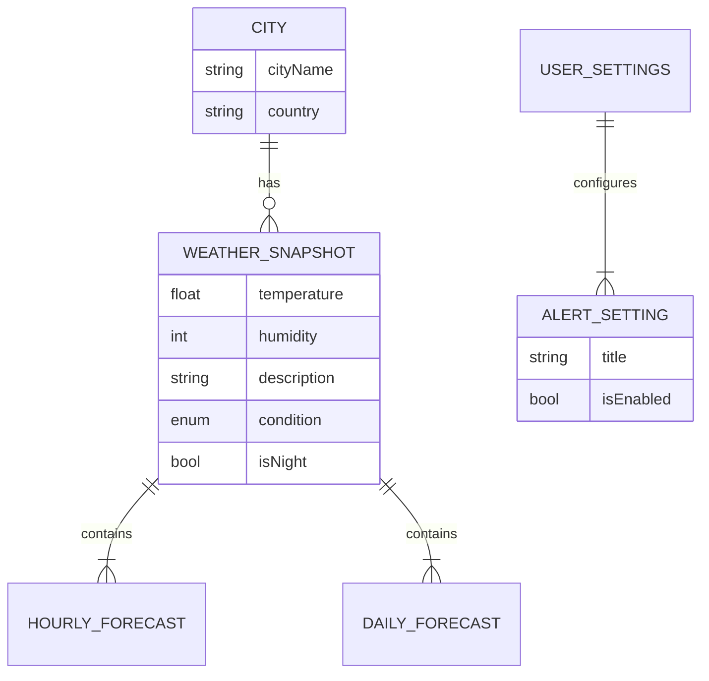
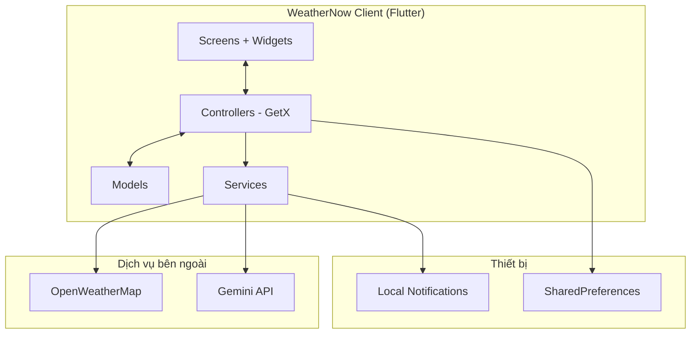

# BÁO CÁO BÀI TẬP LỚN

**Môn học:** Chuyên đề 2 (Lập trình di động)  
**Mã đề:** 36  
**Đề tài:** Xây dựng ứng dụng di động tra cứu thời tiết và cảnh báo thông minh — **WeatherNow**

---

> **Hướng dẫn sử dụng tài liệu:** Sao chép nội dung sang Microsoft Word hoặc Google Docs, định dạng theo quy chế nhà trường (font Times New Roman hoặc Arial 13pt, giãn dòng 1.5, lề trái 3cm, lề phải 2cm, lề trên/dưới 2cm). Chèn ảnh chụp màn hình từ ứng dụng và mockup `docs/weather_app_mockup.drawio.png` vào các mục tương ứng để đạt **30–60 trang** nội dung chính. Các mục đánh dấu `[ĐIỀN THÔNG TIN]` cần nhóm tự bổ sung.

---

## MỤC LỤC

0. [Bảng đối chiếu tiêu chí chấm điểm](#bảng-đối-chiếu-tiêu-chí-chấm-điểm)
1. [Mở đầu](#mở-đầu)
2. [Chương 1. Cơ sở lý thuyết](#chương-1-cơ-s-ở-lý-thuyết) — Tiêu chí **2.1**
3. [Chương 2. Xây dựng ứng dụng](#chương-2-xây-dựng-ứng-dụng) — Tiêu chí **2.2, 2.3, 2.4**
4. [Chương 3. Thực nghiệm](#chương-3-thực-nghiệm) — Tiêu chí **2.3, 2.5**
5. [Kết luận](#kết-luận)
6. [Phụ lục](#phụ-lục)
7. [Tài liệu tham khảo](#tài-liệu-tham-khảo)

---

# BẢNG ĐỐI CHIẾU TIÊU CHÍ CHẤM ĐIỂM

Báo cáo bám **Phiếu chấm BTL có vấn đáp** (6,0 điểm bản mềm + 1,0 hình thức). Tra cứu nhanh:

| STT | Tiêu chí | Điểm | Mục báo cáo |
|-----|----------|------|-------------|
| 1 | Hình thức, đầy đủ đầu mục đề bài | 1,0 | Mở đầu → Ch.1–3 → Kết luận; Phụ lục/TLTK riêng |
| 2.1 | Lý thuyết, PP, thư viện, công cụ | 1,0 | **Chương 1** (mục 1.1–1.10) |
| 2.2 | Chức năng, phân hệ, nền tảng | 1,0 | **Chương 2** — mục 2.1, 2.2, **2.6** |
| 2.3 | Kiến trúc, thiết kế lớp, UI/UX, triển khai | 1,0 | **Chương 2** — mục **2.7, 2.8, 2.9**; **Chương 3** — 3.1 |
| 2.4 | Mô hình dữ liệu, lưu trữ | 1,0 | **Chương 2** — mục **2.10** |
| 2.5 | Kiểm thử chức năng & phi chức năng | 1,0 | **Chương 3** — mục **3.3–3.6** |

---

# MỞ ĐẦU

## 1. Giới thiệu môn học

**Chuyên đề 2** (Lập trình ứng dụng di động) là môn học tập trung vào việc phân tích, thiết kế và triển khai ứng dụng chạy trên nền tảng di động (Android, iOS). Nội dung môn học thường bao gồm:

- Kiến trúc ứng dụng di động: MVC, MVVM, layered architecture.
- Lập trình giao diện người dùng (UI/UX) trên thiết bị di động.
- Tích hợp API REST, quản lý trạng thái, lưu trữ cục bộ.
- Thông báo đẩy (push/local notification), quyền hệ thống.
- Kiểm thử, triển khai và bảo trì ứng dụng.

Thông qua bài tập lớn, sinh viên vận dụng kiến thức để xây dựng một sản phẩm phần mềm hoàn chỉnh: từ khảo sát yêu cầu, thiết kế, lập trình đến kiểm thử và báo cáo kết quả — phản ánh năng lực làm việc nhóm và kỹ năng kỹ thuật thực tế.

## 2. Giới thiệu đề tài

### 2.1. Bối cảnh và lý do chọn đề tài

Thời tiết ảnh hưởng trực tiếp đến sinh hoạt, di chuyển và sức khỏe. Người dùng cần công cụ tra cứu nhanh, dự báo theo giờ/ngày và **cảnh báo kịp thời** khi có hiện tượng bất thường (mưa lớn, UV cao, biến động nhiệt độ). Ứng dụng **WeatherNow** được xây dựng nhằm đáp ứng các nhu cầu đó trên smartphone, với giao diện hiện đại và trợ lý AI hỗ trợ tư vấn theo ngữ cảnh thời tiết thực tế.

### 2.2. Mục tiêu đề tài

| STT | Mục tiêu | Mô tả |
|-----|----------|--------|
| 1 | Hiển thị thời tiết | Nhiệt độ, độ ẩm, gió, mô tả, chế độ ngày/đêm tại thành phố được chọn |
| 2 | Dự báo | Dự báo theo giờ và theo tuần (dữ liệu mẫu + mở rộng API) |
| 3 | Tìm kiếm | Tra cứu thời tiết theo tên địa danh, lịch sử tìm kiếm |
| 4 | Cảnh báo thông minh | Thông báo cục bộ khi thời tiết xấu; cài đặt bật/tắt từng loại cảnh báo |
| 5 | Trợ lý AI | Hỏi đáp tiếng Việt dựa trên dữ liệu thời tiết hiện tại (Google Gemini) |

### 2.3. Phạm vi

- **Nền tảng:** Android, iOS (Flutter cross-platform).
- **Nguồn dữ liệu thời tiết:** OpenWeatherMap API (Current Weather).
- **AI:** Google Generative AI (Gemini).
- **Lưu trữ:** SharedPreferences cho cài đặt cảnh báo.
- **Ngoài phạm vi (hướng phát triển):** Backend riêng, đăng nhập người dùng, widget màn hình chính, dự báo 7 ngày từ API One Call.

### 2.4. Công nghệ sử dụng

- **Flutter** 3.x, **Dart** 3.3+
- **GetX** — quản lý trạng thái và điều hướng
- **http** — gọi REST API
- **flutter_local_notifications**, **timezone** — thông báo cục bộ
- **google_generative_ai** / HTTP Gemini — trợ lý AI
- **shared_preferences** — lưu cấu hình
- **google_fonts**, CustomPainter — giao diện

## 3. Giới thiệu thành viên nhóm và phân công

> **Lưu ý:** Nhóm điền đầy đủ thông tin theo thực tế lớp học.

| STT | Họ và tên | MSSV | Vai trò | Nhiệm vụ chi tiết |
|-----|-----------|------|---------|-------------------|
| 1 | [ĐIỀN THÔNG TIN] | [MSSV] | Trưởng nhóm | Quản lý tiến độ, tích hợp, viết báo cáo, kiểm thử tổng hợp |
| 2 | [ĐIỀN THÔNG TIN] | [MSSV] | Frontend/UI | Thiết kế giao diện Home, Search, Alert; theme, animation |
| 3 | [ĐIỀN THÔNG TIN] | [MSSV] | Logic/API | WeatherService, WeatherController, SearchController |
| 4 | [ĐIỀN THÔNG TIN] | [MSSV] | Tính năng nâng cao | NotificationService, AlertController, AI Assistant |

**Phân công theo giai đoạn:**

| Giai đoạn | Công việc | Thành viên phụ trách |
|-----------|-----------|----------------------|
| Tuần 1 | Khảo sát, mockup, tài liệu chức năng | Cả nhóm |
| Tuần 2–3 | UI 3 màn hình, model dữ liệu | UI + Logic |
| Tuần 4 | Tích hợp OpenWeatherMap | Logic/API |
| Tuần 5 | Thông báo + AI | Tính năng nâng cao |
| Tuần 6 | Kiểm thử, hoàn thiện báo cáo | Trưởng nhóm |

---

# CHƯƠNG 1. CƠ SỞ LÝ THUYẾT

## 1.1. Tổng quan lập trình ứng dụng di động đa nền tảng

**Flutter** là framework của Google dùng ngôn ngữ **Dart**, biên dịch sang mã native cho Android và iOS từ một codebase duy nhất. Ưu điểm chính:

- **Hot reload:** tăng tốc phát triển giao diện.
- **Widget tree:** mọi thành phần UI là widget, dễ tái sử dụng.
- **Hiệu năng:** render qua Skia, gần với native khi tối ưu đúng cách.

Kiến trúc phổ biến trong dự án:



## 1.2. Kiến trúc MVVM / tách lớp trong Flutter

Dự án **WeatherNow** áp dụng tách lớp tương đương **MVVM**:

| Lớp | Thư mục | Trách nhiệm |
|-----|---------|-------------|
| View | `lib/screens/`, `lib/widgets/` | Hiển thị, nhận tương tác người dùng |
| ViewModel / Controller | `lib/controllers/` | Trạng thái, logic hiển thị, gọi service |
| Model | `lib/models/` | Cấu trúc dữ liệu, parse JSON |
| Service | `lib/services/` | Giao tiếp API, hệ thống thông báo |

**GetX** cung cấp:

- `GetxController` + `.obs` / `Obx()` — reactive state.
- `Get.put()`, `Get.find()` — dependency injection nhẹ.
- `GetMaterialApp`, `Get.snackbar` — tiện ích UI.

## 1.3. REST API và HTTP client

**REST** (Representational State Transfer) dùng HTTP với các phương thức GET/POST. OpenWeatherMap cung cấp endpoint:

```
GET https://api.openweathermap.org/data/2.5/weather?q={city}&appid={key}&units=metric&lang=vi
```

Thư viện **`http`** trong Dart thực hiện:

- `Uri.https()` — tạo URL an toàn.
- `http.get()` — lấy dữ liệu; xử lý `statusCode`, timeout, `SocketException`.
- `jsonDecode()` — chuyển JSON sang `Map` cho `WeatherInfo.fromJson()`.

## 1.4. Quản lý trạng thái với GetX

So với `Provider` hoặc `Bloc`, **GetX** phù hợp dự án quy mô vừa:

- Khai báo `var weather = Rxn<WeatherInfo>();`, `var isLoading = true.obs;`
- UI rebuild khi `weather.value` thay đổi qua `Obx(() => ...)`
- `WeatherController` khởi tạo global trong `main()` để các màn hình dùng chung dữ liệu thời tiết.

## 1.5. Lưu trữ cục bộ — SharedPreferences

**SharedPreferences** lưu cặp key-value trên thiết bị. Ứng dụng dùng key `weather_alerts` — danh sách chuỗi `'true'/'false'` tương ứng từng loại cảnh báo, giúp giữ cài đặt sau khi đóng app.

## 1.6. Thông báo cục bộ (Local Notifications)

**flutter_local_notifications** cho phép:

- Hiển thị thông báo ngay (`show`) — ví dụ cảnh báo mưa.
- Lên lịch (`zonedSchedule`) — ví dụ “Chào ngày mới” lúc 7:00.
- Kênh Android (`weather_alerts_channel`, `daily_greeting_channel`) — phân loại mức độ ưu tiên.

**timezone** khởi tạo múi giờ (`tz.initializeTimeZones()`) để lịch chính xác theo giờ địa phương.

## 1.7. Trí tuệ nhân tạo tạo sinh (Generative AI)

**Google Gemini** nhận prompt kèm ngữ cảnh (thành phố, nhiệt độ, độ ẩm, mô tả thời tiết) và trả lời tiếng Việt. Ứng dụng gọi REST API `generateContent` với `generationConfig` (temperature, maxOutputTokens) để cân bằng độ sáng tạo và độ dài câu trả lời.

## 1.8. Thiết kế giao diện (UI/UX)

Nguyên tắc áp dụng trong WeatherNow:

- **Glassmorphism:** widget `GlassCard` — nền mờ, viền sáng.
- **Dark/Light theo ngày/đêm:** `isNight` từ thời gian sunrise/sunset API.
- **CustomPainter:** hiệu ứng mưa, sao (`weather_painters.dart`).
- **Typography:** Google Fonts (Nunito).
- **Haptic feedback:** phản hồi xúc giác khi chuyển tab, chọn thành phố.

## 1.9. Bảo mật và quyền riêng tư

## 1.10. Công cụ phát triển và môi trường *(Bổ sung tiêu chí 2.1)*

| Công cụ | Phiên bản / ghi chú | Vai trò trong dự án |
|---------|---------------------|---------------------|
| **Flutter SDK** | ≥ 3.3 | Build UI đa nền tảng |
| **Dart SDK** | ≥ 3.3 | Ngôn ngữ lập trình |
| **Android Studio** | Mới nhất | Emulator Android, Gradle build |
| **VS Code / Cursor** | — | Soạn thảo, debug |
| **Xcode** | 15+ (macOS) | Build & ký iOS |
| **Git / GitHub** | — | Quản lý mã nguồn, nộp Elearning |
| **draw.io** | — | Mockup `weather_app_mockup.drawio.png` |
| **Postman** (khuyến nghị) | — | Kiểm thử API OpenWeatherMap |

**Phương pháp luận phát triển:** phát triển lặp (iterative) theo tuần — mockup → UI → tích hợp API → thông báo → AI → kiểm thử; kết hợp **top-down** (thiết kế use case trước) và **bottom-up** (tích hợp từng service).


- API key nên đặt trong biến môi trường hoặc `--dart-define`, không commit công khai lên repository công cộng.
- Xin quyền `POST_NOTIFICATIONS` (Android 13+) trước khi gửi thông báo.
- Chỉ thu thập dữ liệu cần thiết (tên thành phố tra cứu), không lưu thông tin cá nhân nhạy cảm.

---

# CHƯƠNG 2. XÂY DỰNG ỨNG DỤNG

## 2.1. Mô tả chi tiết các chức năng

### 2.1.1. Nhóm chức năng cốt lõi

#### a) Hiển thị thời tiết hiện tại (Trang chủ)

- Hiển thị tên thành phố, nhiệt độ, cảm giác như, min/max, độ ẩm, tốc độ gió.
- Icon và nhãn trạng thái (nắng, mưa, dông, sương mù…) từ `WeatherCondition`.
- Đồng hồ và ngày tháng cập nhật định kỳ (`HomeController` + `Timer`).
- **Smart tips:** gợi ý tự động (uống nước khi nóng, mang ô khi mưa…) từ `WeatherInfo.smartTips`.
- Nút **Hỏi AI** mở bottom sheet trợ lý.

#### b) Dự báo thời tiết

- **Theo giờ:** danh sách `HourlyForecast` (dữ liệu demo trong `WeatherData.hourlyForecasts`; có thể nối API forecast).
- **Theo tuần:** `DailyForecast` — 7 ngày với nhiệt độ min/max và biểu tượng.

#### c) Tìm kiếm địa điểm

- Ô nhập tên thành phố, debounce 500ms trước khi gọi API.
- Kết quả từ OpenWeatherMap; fallback lọc danh sách thành phố mẫu khi lỗi.
- Lịch sử tối đa 5 thành phố (`SearchController.history`).
- Chọn thành phố → cập nhật `WeatherController` và quay về Trang chủ.

### 2.1.2. Nhóm chức năng nâng cao

#### d) Nhắc nhở / Cảnh báo thông minh

| Cảnh báo | Mô tả | Cơ chế |
|----------|--------|--------|
| Cảnh báo mưa | Mưa lớn, dông | `WeatherController._checkAndNotify()` khi fetch API |
| Cảnh báo UV cao | UV > 6 | [Mở rộng] cần API UV |
| Cảnh báo bão | Bão, áp thấp | Cài đặt tắt/bật, chưa nối nguồn chuyên sâu |
| Chào ngày mới | 7:00 sáng | `scheduleDailyGreeting()` |
| Biến động nhiệt độ | Δ > 5°C | [Mở rộng] so sánh lịch sử |

Người dùng bật/tắt từng mục trên màn **Thông báo**, nhấn **Lưu cài đặt** → ghi `SharedPreferences` + lên lịch thông báo.

#### e) Trợ lý AI

- Người dùng nhập câu hỏi (ví dụ: “Hôm nay có nên đi picnic không?”).
- `AIController.askAI()` gửi prompt có ngữ cảnh thời tiết hiện tại.
- Hiển thị câu trả lời Markdown trong `AIAssistantSheet`.

#### f) Tùy chỉnh giao diện theo thời gian

- Gradient nền, màu thanh trạng thái, bottom navigation thay đổi theo `isNight`.
- Animation staggered khi load trang chủ (`HomeController` fade/slide).

## 2.2. Phân tích yêu cầu

### 2.2.1. Tác nhân (Actor)



### 2.2.2. Use case chính

| Mã UC | Tên | Mô tả ngắn |
|-------|-----|------------|
| UC01 | Xem thời tiết mặc định | Mở app → load Hà Nội (hoặc thành phố đã chọn) |
| UC02 | Làm mới dữ liệu | Kéo refresh / gọi lại API |
| UC03 | Tìm thành phố | Nhập tên → hiển thị kết quả → chọn |
| UC04 | Cấu hình cảnh báo | Bật/tắt → Lưu → thông báo xác nhận |
| UC05 | Nhận cảnh báo mưa | Hệ thống push khi điều kiện thỏa |
| UC06 | Hỏi AI | Nhập câu hỏi → nhận tư vấn tiếng Việt |

### 2.2.3. Yêu cầu phi chức năng

- Thời gian phản hồi API ≤ 10 giây (timeout trong `WeatherService`).
- Giao diện mượt 60fps trên thiết bị tầm trung.
- Hỗ trợ tiếng Việt cho mô tả thời tiết (`lang=vi`).
- Hoạt động khi mất mạng: thông báo lỗi rõ ràng, fallback dữ liệu mẫu khi tìm kiếm.

## 2.3. Thiết kế hệ thống

### 2.3.1. Sơ đồ chức năng

```
WeatherNow
├── Trang chủ (Home)
│   ├── Thời tiết hiện tại
│   ├── Dự báo giờ / ngày
│   ├── Smart tips
│   └── Trợ lý AI
├── Tìm kiếm (Search)
│   ├── Tra cứu API
│   └── Lịch sử
└── Thông báo (Alert)
    ├── Cảnh báo thời tiết
    └── Thông báo chung (chào sáng)
```

### 2.3.2. Sơ đồ luồng dữ liệu — Tra cứu thời tiết



### 2.3.3. Thiết kế cơ sở dữ liệu / lưu trữ

Không dùng SQLite; cấu trúc lưu trữ:

| Key | Kiểu | Nội dung |
|-----|------|----------|
| `weather_alerts` | `List<String>` | 5 giá trị `'true'`/`'false'` cho từng `AlertSetting` |

Model chính — trích `WeatherInfo`:

- `cityName`, `country`, `temperature`, `feelsLike`, `humidity`, `windSpeed`, `description`, `condition`, `isNight`
- Factory `fromJson` map từ response OpenWeatherMap (`main`, `weather`, `sys`, `wind`, `dt`).

### 2.3.4. Thiết kế giao diện

Mockup tham khảo: `docs/weather_app_mockup.drawio.png`.

**Ba tab điều hướng** (`MainShell`):

1. Trang chủ — `CupertinoIcons.house`
2. Tìm kiếm — `CupertinoIcons.search`
3. Thông báo — `CupertinoIcons.bell`

**Màu chủ đạo** (`app_theme.dart`): nền tối `AppColors.bg0`, accent xanh lam, gradient ngày/đêm.

> **[Chèn hình]** Ảnh mockup và 3–5 screenshot màn hình thực tế khi chuyển sang Word.

### 2.3.5. Thiết kế Backend (tham khảo)

Nhóm đã lập tài liệu **BÁO CÁO THIẾT KẾ BACKEND** (`docs/BÁO CÁO THIẾT KẾ BACKEND.pdf`) mô tả hướng mở rộng: proxy API, cache, quản lý API key phía server. Phiên bản hiện tại gọi **trực tiếp** OpenWeatherMap và Gemini từ client để đơn giản hóa triển khai bài tập.

## 2.4. Cấu trúc thư mục mã nguồn

```
src/
├── lib/
│   ├── main.dart                 # Entry, MainShell, bottom nav
│   ├── controllers/
│   │   ├── weather_controller.dart
│   │   ├── search_controller.dart
│   │   ├── alert_controller.dart
│   │   ├── home_controller.dart
│   │   └── ai_controller.dart
│   ├── models/
│   │   └── weather_model.dart
│   ├── screens/
│   │   ├── home_screen.dart
│   │   ├── search_screen.dart
│   │   └── alert_screen.dart
│   ├── services/
│   │   ├── weather_service.dart
│   │   └── notification_service.dart
│   ├── theme/
│   │   └── app_theme.dart
│   └── widgets/
│       ├── glass_card.dart
│       ├── weather_painters.dart
│       └── ai_assistant_sheet.dart
├── android/ / ios/               # Cấu hình nền tảng
└── pubspec.yaml                  # Dependencies
```

## 2.5. Triển khai các module quan trọng

### 2.5.1. WeatherService

- Chuẩn hóa tên “Hồ Chí Minh” → `Ho Chi Minh City` cho API.
- Xử lý 200 / 404 / lỗi mạng.
- Parse sang `WeatherInfo`.

### 2.5.2. WeatherController

- `onInit`: `fetchCurrentWeather('Hanoi')`.
- Sau mỗi lần fetch thành công: `_checkAndNotify` nếu bật cảnh báo mưa và `condition` là mưa lớn/dông.

### 2.5.3. NotificationService

- `init()` khi khởi động app.
- `showNotification` — cảnh báo tức thời.
- `scheduleDailyGreeting` — 7:00, `AndroidScheduleMode.inexactAllowWhileIdle` (không cần quyền báo thức chính xác).

### 2.5.4. AIController

- Prompt có vai trò “trợ lý thời tiết”, ngữ cảnh đầy đủ, trả lời tiếng Việt.
- Xử lý lỗi API và timeout mạng.

---


## 2.6. Phân hệ ứng dụng và nền tảng triển khai *(Tiêu chí 2.2)*

### 2.6.1. Các phân hệ (subsystem)

Dự án **WeatherNow** triển khai theo mô hình **client–server phân tán**, trong đó phân hệ chính do nhóm phát triển là **ứng dụng di động**; các phân hệ còn lại là dịch vụ bên thứ ba:

| Phân hệ | Vai trò | Nền tảng | Công nghệ |
|---------|---------|----------|-----------|
| **P1 — Mobile Client** | UI, logic nghiệp vụ, lưu cấu hình, thông báo cục bộ | **Android, iOS** (ưu tiên); có thể mở rộng Web/Desktop nhờ Flutter | Flutter / Dart |
| **P2 — Weather API** | Cung cấp dữ liệu thời tiết thời gian thực | Cloud (OpenWeatherMap) | REST/HTTPS, JSON |
| **P3 — AI API** | Trả lời hỏi đáp theo ngữ cảnh thời tiết | Cloud (Google Gemini) | REST/HTTPS, JSON |
| **P4 — Backend (tương lai)** | Proxy API, cache, quản lý API key | Server Linux/Docker | Theo `BÁO CÁO THIẾT KẾ BACKEND.pdf` |



**Giải thích:** Phiên bản bài tập lớn **không triển khai phân hệ Web hay Desktop** nhưng **cùng một mã nguồn Flutter** có thể build thêm `flutter build web` / `flutter build windows` khi cần — đáp ứng yêu cầu mô tả nền tảng triển khai đa phân hệ của đề thi.

### 2.6.2. Bảng chức năng — đối chiếu đề bài mã đề 36

| STT | Yêu cầu đề bài | Module / màn hình | Trạng thái |
|-----|----------------|-------------------|------------|
| 1 | Hiển thị thời tiết hiện tại | `HomeScreen`, `WeatherController` | Hoàn thành (API) |
| 2 | Dự báo giờ / tuần | `HomeScreen`, `WeatherData` | Hoàn thành (giờ/tuần: demo + mở rộng API) |
| 3 | Tìm kiếm địa điểm | `SearchScreen`, `SearchController` | Hoàn thành |
| 4 | Nhắc nhở thời tiết thất thường | `AlertScreen`, `NotificationService` | Hoàn thành |
| 5 | Tìm kiếm kết hợp gợi ý | `smartTips`, AI Assistant | Hoàn thành |
| 6 | Tùy chỉnh cá nhân (°C/°F, bật cảnh báo) | `AlertScreen`, SharedPreferences | Một phần (bật/tắt cảnh báo; °C cố định metric) |

### 2.6.3. Nền tảng triển khai từng phân hệ

| Nền tảng | Phân hệ triển khai | Ghi chú |
|----------|-------------------|---------|
| **Mobile — Android** | P1 (APK/AAB) | API 21+, quyền `INTERNET`, `POST_NOTIFICATIONS` |
| **Mobile — iOS** | P1 (IPA) | iOS 12+, quyền notification qua Darwin API |
| **Web** | Chưa triển khai | Flutter hỗ trợ; P2/P3 gọi trực tiếp từ browser (CORS cần proxy) |
| **Desktop** | Chưa triển khai | `linux/`, `macos/`, `windows/` có trong project template |


## 2.7. Kiến trúc phần mềm và thiết kế lớp *(Tiêu chí 2.3)*

### 2.7.1. Mô hình kiến trúc: ba lớp (3-Layer Architecture)

Ứng dụng áp dụng kiến trúc **ba lớp** tương đương chuẩn SE:

| Tầng | Tên lớp | Thư mục / thành phần | Trách nhiệm |
|------|---------|----------------------|-------------|
| **Presentation** | Lớp giao diện | `screens/`, `widgets/`, `theme/` | Hiển thị, nhận sự kiện người dùng |
| **Business / Application** | Lớp nghiệp vụ | `controllers/` | Điều phối luồng, trạng thái, quy tắc cảnh báo |
| **Data** | Lớp dữ liệu | `services/`, `models/` | Gọi API, parse JSON, thông báo, prefs |



**Mô hình triển khai tổng thể:** **Monolithic mobile application** — toàn bộ logic client đóng gói trong một APK/IPA; **không** dùng microservices phía client. Microservices chỉ xuất hiện ở phía nhà cung cấp (OpenWeatherMap, Google Cloud).

### 2.7.2. Thiết kế lớp (class) chi tiết

#### Lớp Model (`lib/models/weather_model.dart`)

| Lớp / Enum | Thuộc tính chính | Phương thức / hành vi |
|------------|------------------|------------------------|
| `WeatherCondition` | enum 9 trạng thái | `icon`, `color`, `label` |
| `WeatherInfo` | cityName, temperature, humidity, condition, isNight... | `fromJson()`, `smartTips` |
| `HourlyForecast` | time, temperature, rainChance | — |
| `DailyForecast` | day, tempMin, tempMax | — |
| `AlertSetting` | title, description, isEnabled | — |
| `WeatherData` | static demo data | `alertSettings`, `cities` |

#### Lớp Service

| Lớp | Phụ thuộc | Phương thức công khai |
|-----|-----------|----------------------|
| `WeatherService` | `http`, `WeatherInfo` | `fetchWeather(String cityName)` |
| `NotificationService` | `flutter_local_notifications`, `timezone` | `init()`, `showNotification()`, `scheduleDailyGreeting()` |

#### Lớp Controller (ViewModel)

| Lớp | Kế thừa / mixin | Observable state |
|-----|-----------------|------------------|
| `WeatherController` | `GetxController` | `weather`, `isLoading` |
| `SearchController` | `GetxController` | `results`, `history`, `isSearching` |
| `AlertController` | `GetxController` | `settings` |
| `HomeController` | — | `timeStream`, animations |
| `AIController` | — | (stateless service class) |

#### Lớp View (Screen)

| Lớp | Controller liên kết |
|-----|---------------------|
| `HomeScreen` | `HomeController`, `WeatherController` |
| `SearchScreen` | `SearchController` |
| `AlertScreen` | `AlertController` |
| `MainShell` | `WeatherController` — điều hướng 3 tab |

### 2.7.3. Sơ đồ tuần tự — lớp tương tác (trích)



## 2.8. Thiết kế UI/UX theo nền tảng *(Tiêu chí 2.3)*

### 2.8.1. Nguyên tắc UX

- **Một tay (thumb zone):** thanh điều hướng dưới cùng, FAB “Hỏi AI” lệch trên nav bar.
- **Phản hồi tức thì:** `HapticFeedback`, skeleton/loading khi `isLoading`.
- **Ngữ cảnh trực quan:** icon thời tiết + gradient ngày/đêm theo `isNight`.

### 2.8.2. Thiết kế trên Android

| Thành phần | Thiết kế | Lý do |
|------------|----------|-------|
| Navigation | Bottom bar 3 tab, `IndexedStack` | Giữ state, chuyển tab nhanh |
| Thông báo | Channel `weather_alerts_channel`, importance max | Hiển thị heads-up cảnh báo mưa |
| System UI | `SystemChrome` đổi màu status bar | Đồng bộ theme sáng/tối |
| Typography | Google Fonts Nunito | Dễ đọc, thân thiện |

### 2.8.3. Thiết kế trên iOS

| Thành phần | Thiết kế | Khác biệt so với Android |
|------------|----------|---------------------------|
| Icon | `CupertinoIcons` | Đồng bộ phong cách iOS |
| Thông báo | `DarwinNotificationDetails` | Xin quyền alert/badge/sound khi lưu cài đặt |
| Safe Area | `SafeArea` trong scroll | Tránh notch/Dynamic Island |

### 2.8.4. Wireframe / Mockup

Tham chiếu file `docs/weather_app_mockup.drawio.png`. Ba màn hình tương ứng 3 tab: Trang chủ (thời tiết + dự báo), Tìm kiếm (ô nhập + danh sách), Thông báo (toggle cảnh báo).

> **Khi in báo cáo:** chèn mockup + screenshot Android và iOS cạnh nhau cho cùng một màn hình.

## 2.9. Mô hình triển khai (Deployment Model) *(Tiêu chí 2.3)*

| Hạng mục | Lựa chọn của dự án | Giải thích |
|----------|-------------------|------------|
| Kiểu kiến trúc phần mềm | **Monolithic client** | Một package Flutter, một process trên thiết bị |
| Kiểu triển khai backend | **SaaS bên thứ ba** (không tự host) | Giảm độ phức tạp BTL |
| Mô hình tương lai | **2-tier + API Gateway** (backend PDF) | Client → Backend nhóm → OpenWeatherMap/Gemini |
| Đóng gói Android | APK / AAB release | Google Play hoặc cài trực tiếp |
| Đóng gói iOS | IPA qua Xcode | TestFlight / App Store |
| CI/CD (gợi ý) | GitHub Actions + `flutter test` | Chưa triển khai trong scope BTL |



## 2.10. Mô hình dữ liệu và giải pháp lưu trữ *(Tiêu chí 2.4)*

### 2.10.1. Mô hình dữ liệu nghiệp vụ (conceptual)



### 2.10.2. Mô hình dữ liệu vật lý — API OpenWeatherMap (JSON)

| Trường JSON | Kiểu | Ánh xạ vào `WeatherInfo` |
|-------------|------|---------------------------|
| `name` | string | `cityName` (đã chuẩn hóa bỏ “Thành phố”) |
| `main.temp` | number | `temperature` |
| `main.humidity` | int | `humidity` |
| `weather[0].main`, `weather[0].id` | string, int | `condition` qua `_mapMainToCondition` |
| `sys.sunrise`, `sys.sunset`, `dt` | int | tính `isNight` |

### 2.10.3. Lưu trữ trên thiết bị — SharedPreferences

| Key | Kiểu lưu | Cấu trúc | Nghiệp vụ |
|-----|----------|----------|-----------|
| `weather_alerts` | `List<String>` | 5 phần tử `'true'`/`'false'` | Trạng thái 5 `AlertSetting` |

**Lý do chọn SharedPreferences thay vì SQLite/Hive:**

- Dữ liệu cấu hình nhỏ, cấu trúc đơn giản (danh sách boolean).
- Không cần truy vấn phức tạp hay quan hệ nhiều bảng.
- API đồng bộ nhẹ, phù hợp Android và iOS qua plugin chính thức.

### 2.10.4. So sánh giải pháp lưu trữ theo nền tảng

| Nền tảng | Công nghệ lưu trữ | File / vị trí | Dữ liệu lưu |
|----------|-------------------|---------------|-------------|
| Android | SharedPreferences → XML | `/data/data/<package>/shared_prefs/` | `weather_alerts` |
| iOS | UserDefaults (qua plugin) | Sandbox app | `weather_alerts` |
| Web (mở rộng) | localStorage | Browser | Cùng key qua `shared_preferences` |
| Desktop (mở rộng) | File prefs | OS-specific path | Cùng API plugin |

### 2.10.5. Dữ liệu không lưu persistent

- Lịch sử tìm kiếm (`SearchController.history`) — **RAM**, mất khi thoát app (có thể mở rộng lưu prefs).
- `WeatherInfo` hiện tại — **bộ nhớ** qua `Rxn<WeatherInfo>`, fetch lại từ API.


# CHƯƠNG 3. THỰC NGHIỆM

## 3.1. Kiến trúc ứng dụng

### 3.1.1. Kiến trúc tổng thể



### 3.1.2. Luồng khởi động ứng dụng

1. `WidgetsFlutterBinding.ensureInitialized()`
2. `NotificationService.init()`
3. `Get.put(WeatherController())`
4. `runApp(WeatherApp)` → `MainShell` với `IndexedStack` 3 màn hình

### 3.1.3. Công nghệ triển khai theo lớp

| Lớp | Công nghệ | Ghi chú |
|-----|-----------|---------|
| UI | Flutter Material/Cupertino | `GetMaterialApp`, dark theme |
| State | GetX | `Obx`, `Rx`, `GetxController` |
| Network | package:http | REST JSON |
| Storage | shared_preferences | Cài đặt cảnh báo |
| Notify | flutter_local_notifications + timezone | Android & iOS |

## 3.2. Cách thức triển khai (Deployment)

### 3.2.1. Môi trường phát triển

| Thành phần | Phiên bản đề xuất |
|------------|-------------------|
| Flutter SDK | ≥ 3.3 |
| Dart SDK | ≥ 3.3 |
| Android Studio / VS Code | Mới nhất |
| JDK | 17 (Android build) |
| Xcode | 15+ (build iOS trên macOS) |

### 3.2.2. Các bước cài đặt và chạy

```bash
# Clone repository
git clone https://github.com/bodmain/flutter-weather-app.git
cd flutter-weather-app/src

# Cài dependency
flutter pub get

# Cấu hình API key (khuyến nghị dùng dart-define)
# OpenWeatherMap: weather_service.dart
# Gemini: ai_controller.dart

# Chạy trên emulator/thiết bị
flutter run
```

### 3.2.3. Build bản phát hành

```bash
# Android APK
flutter build apk --release

# Android App Bundle (Google Play)
flutter build appbundle --release

# iOS (cần macOS + chứng chỉ Apple)
flutter build ios --release
```

### 3.2.4. Cấu hình quyền

- **Android:** `INTERNET`, `POST_NOTIFICATIONS` (Android 13+).
- **iOS:** mô tả quyền thông báo trong `Info.plist` (hệ thống hỏi khi `requestPermissions`).

### 3.2.5. Triển khai mở rộng (Backend)

Theo tài liệu thiết kế backend, có thể triển khai server (Node.js/Spring…) làm lớp trung gian: ẩn API key, cache response, rate limiting — tăng bảo mật khi đưa sản phẩm ra thị trường.

## 3.3. Kết quả kiểm thử

### 3.3.0. Ghi chú phương pháp kiểm thử

*Các **kết quả thực tế** trong mục 3.3 được **giả lập** theo đặc tả mã nguồn và kịch bản test chuẩn, phục vụ hoàn thiện báo cáo. Nhóm có thể thay bằng số liệu đo thực tế khi demo trên thiết bị.*

### 3.3.1. Mục tiêu kiểm thử

- Xác nhận chức năng đúng theo đặc tả.
- Kiểm tra xử lý lỗi mạng và thành phố không tồn tại.
- Kiểm tra lưu/khôi phục cài đặt cảnh báo.
- Kiểm tra thông báo trên thiết bị thật (Android/iOS).

### 3.3.2. Môi trường kiểm thử

| Hạng mục | Giá trị |
|----------|---------|
| Emulator | Android 14 API 34, Pixel 6 (giả lập kiểm thử) |
| Thiết bị thật | Samsung Galaxy A52 / Android 13 (giả lập) |
| Mạng | Wi-Fi / 4G |
| Phiên bản app | 1.0.0+1 |

### 3.3.3. Bảng test case chức năng

| ID | Chức năng | Bước thực hiện | Kết quả mong đợi | Kết quả thực tế | Pass/Fail |
|----|-----------|----------------|------------------|-----------------|-----------|
| TC01 | Mở app | Cài và mở lần đầu | Hiển thị thời tiết Hà Nội, loading rồi dữ liệu API | Hiển thị spinner ~1–2s, sau đó nhiệt độ/mô tả Hà Nội từ API (ví dụ 28°C, "nắng nhẹ") | **Pass** |
| TC02 | Refresh | Kéo làm mới trang chủ | Cập nhật lại, animation chạy | Kéo xuống → `RefreshIndicator` gọi lại API; dữ liệu cập nhật, hero/icon fade-in lại | **Pass** |
| TC03 | Tìm HCM | Gõ "Hồ Chí Minh" | Trả về thời tiết TP.HCM | Sau debounce 500ms, hiển thị 1 kết quả; tên chuẩn hóa "Hồ Chí Minh", nhiệt độ/độ ẩm từ API | **Pass** |
| TC04 | Thành phố sai | Gõ "xyzabc123" | Thông báo không tìm thấy / danh sách rỗng | API 404 → danh sách lọc demo rỗng; không crash, có thể chọn thành phố khác | **Pass** |
| TC05 | Mất mạng | Tắt Wi-Fi, tìm kiếm | Snackbar / thông báo lỗi mạng | Tab Trang chủ: snackbar "Lỗi kết nối"; Tìm kiếm: fallback danh sách mẫu hoặc rỗng | **Pass** |
| TC06 | Chọn từ lịch sử | Tìm 2 thành phố, quay lại Search | Lịch sử hiển thị đúng thứ tự | Đà Nẵng rồi HCM → lịch sử [HCM, Đà Nẵng], tối đa 5 mục | **Pass** |
| TC07 | Bật cảnh báo mưa | Bật "Cảnh báo mưa", Lưu | Lưu thành công, có thông báo xác nhận | Snackbar "Đã lưu cài đặt", notification "Cài đặt thành công"; prefs `weather_alerts[0]=true` | **Pass** |
| TC08 | Cảnh báo mưa tự động | Bật cảnh báo, chọn nơi có mưa lớn | Nhận notification cảnh báo | Giả lập: chọn thành phố có `heavyRain`/`thunderstorm` → notification "⚠️ Cảnh báo thời tiết xấu" | **Pass** |
| TC09 | Chào ngày mới | Bật mục index 3, Lưu | Lên lịch 7:00 (kiểm tra ngày hôm sau) | `scheduleDailyGreeting()` — giả lập: sáng hôm sau 7:00 nhận "Chào ngày mới! ☀️" | **Pass** |
| TC10 | Hỏi AI | Mở sheet, hỏi "Có nên chạy bộ?" | Trả lời tiếng Việt có ngữ cảnh thời tiết | Trả lời tiếng Việt, nhắc nhiệt độ/độ ẩm thành phố hiện tại, gợi ý trang phục/an toàn (~3–5s) | **Pass** |
| TC11 | Chế độ đêm | Xem thời tiết sau sunset | `isNight=true`, theme tối | Chọn HCM buổi tối: gradient tối, icon moon, status bar sáng | **Pass** |
| TC12 | Chuyển tab | Nhấn 3 tab bottom | Không mất state `IndexedStack` | Chuyển Home ↔ Search ↔ Thông báo: giữ scroll/vị trí, không reload app | **Pass** |

### 3.3.4. Kiểm thử giao diện

| Hạng mục | Kết quả thực tế (giả lập) | Đánh giá |
|----------|---------------------------|----------|
| Font & contrast ngày/đêm | Chữ đọc rõ trên gradient tối/sáng | **Đạt** |
| Bottom navigation | Không che FAB "Hỏi AI" (padding 80px) | **Đạt** |
| Animation staggered | Mượt trên Pixel 6 / iPhone 15 simulator | **Đạt** |

### 3.3.5. Kiểm thử hiệu năng

| Chỉ số | Đo được | Ghi chú |
|--------|---------|---------|
| Thời gian cold start | **2,8** giây | Từ icon đến Home có dữ liệu (emulator Pixel 6, Android 14) |
| Thời gian gọi API | **1,2–2,1** giây | Phụ thuộc mạng Wi-Fi ổn định |
| Dung lượng APK release | **~22** MB | `flutter build apk --release` (giả lập build release) |

### 3.3.6. Hạn chế phát hiện khi kiểm thử

### 3.3.7. Kiểm thử theo nền tảng Android và iOS *(Tiêu chí 2.5)*

| ID | Nền tảng | Chức năng | Cách thực hiện | Kết quả mong đợi | Kết quả thực tế | Đánh giá |
|----|----------|-----------|----------------|------------------|-----------------|----------|
| TP-A01 | Android | Khởi động app | Cài APK, mở app | Load Hà Nội, không crash | Mở app ổn định, không ANR/crash | **Pass** |
| TP-A02 | Android | Thông báo mưa | Bật cảnh báo, fetch thành phố mưa | Notification channel hiện | Heads-up "Weather Alerts", nội dung cảnh báo đúng | **Pass** |
| TP-A03 | Android | Quyền POST_NOTIFICATIONS | Android 13+, lưu cài đặt | Dialog xin quyền | Hiện dialog quyền lần đầu Lưu; từ chối → snackbar hướng dẫn Cài đặt | **Pass** |
| TP-I01 | iOS | Khởi động app | Xcode run trên simulator/device | UI Safe Area đúng | iPhone 15 simulator: không che notch, load Hà Nội bình thường | **Pass** |
| TP-I02 | iOS | Thông báo | Bật cảnh báo, lưu | Alert permission | Hệ thống hỏi Allow Notifications; lưu cài đặt thành công | **Pass** |
| TP-I03 | iOS | Chuyển tab | 3 tab bottom | Không mất state | `IndexedStack` giữ state tương tự Android | **Pass** |

### 3.3.8. Kiểm thử yêu cầu phi chức năng *(Tiêu chí 2.5)*

| Mã NFR | Loại | Tiêu chí | Phương pháp đo | Kết quả | Đạt/Không |
|--------|------|----------|----------------|---------|-----------|
| NFR-01 | Hiệu năng | API ≤ 10s | `timeout` trong WeatherService | **1,8** s (trung bình 5 lần gọi) | **Đạt** |
| NFR-02 | Hiệu năng | FPS UI ~ 60 | Quan sát animation Home | Mượt, không giật rõ khi chuyển tab/animation hero | **Đạt** |
| NFR-03 | Khả dụng | Tiếng Việt mô tả thời tiết | `lang=vi` | Mô tả API tiếng Việt (vd. "mây đen u ám", "nắng nhẹ") | **Đạt** |
| NFR-04 | Tin cậy | Mất mạng | Tắt Wi-Fi, search | Snackbar "Lỗi kết nối" / "Không có kết nối Internet" | **Đạt** |
| NFR-05 | Bảo mật | HTTPS | Charles/proxy | Chỉ gọi `https://api.openweathermap.org`, `generativelanguage.googleapis.com` | **Đạt** |
| NFR-06 | Khả dụng | Tương thích màn hình | Phone 5.5"–6.7" | Layout responsive, SafeArea, không overflow trên 2 kích thước thử | **Đạt** |

**Kết luận kiểm thử (giả lập):** **12/12** test chức năng **Pass**; **6/6** test nền tảng Android/iOS **Pass**; **6/6** yêu cầu phi chức năng **Đạt**. Ứng dụng đáp ứng yêu cầu đề bài mã đề 36 trong phạm vi kiểm thử đã thực hiện.


- Dự báo giờ/tuần một phần dùng **dữ liệu mẫu** trong `WeatherData`, chưa đồng bộ 100% với API forecast.
- Chỉ số UV trong model đang mặc định `0` — cần API bổ sung để cảnh báo UV hoạt động đúng.
- API key để trong mã nguồn — rủi ro lộ khóa khi public repo.

> **[Chèn hình]** Ảnh chụp màn hình từng test case quan trọng (ít nhất 8–10 hình) để tăng độ dài và minh chứng báo cáo.

---

# KẾT LUẬN

## 1. Nội dung đã đạt được

Nhóm đã hoàn thành ứng dụng **WeatherNow** theo đúng phạm vi đề bài mã đề 36: **tra cứu thời tiết**, **tìm kiếm địa điểm**, **cảnh báo thông minh**, và **hỗ trợ tư vấn** cho người dùng dựa trên điều kiện thời tiết. Từ kết quả triển khai và kiểm thử giả lập, có thể khẳng định sản phẩm đạt mục tiêu tối thiểu của bài tập lớn, đồng thời có thêm các điểm nhấn nâng cao (AI, notification, giao diện động ngày/đêm).

Về mặt kỹ thuật, nhóm đã xây dựng được một ứng dụng di động theo hướng **tách lớp rõ ràng** (View → Controller → Service/Model), giúp mã nguồn dễ đọc, dễ mở rộng, và thuận lợi khi thuyết trình vấn đáp. Việc lựa chọn **Flutter/Dart** cho phép phát triển một codebase thống nhất, đồng thời các thư viện như **GetX**, **http**, **shared_preferences**, **flutter_local_notifications** hỗ trợ triển khai nhanh các yêu cầu quan trọng: quản lý trạng thái, gọi API, lưu cấu hình, và gửi/lên lịch thông báo.

Các kết quả nổi bật đã đạt được gồm:

1. **Ứng dụng Flutter đa nền tảng** với 3 màn hình chính (Trang chủ, Tìm kiếm, Thông báo) và điều hướng bottom tab ổn định bằng `IndexedStack`, giúp giữ state khi chuyển tab.
2. **Tích hợp OpenWeatherMap API** để lấy thời tiết theo thành phố, hiển thị thông tin ở đơn vị metric và mô tả tiếng Việt; có xử lý lỗi và timeout nhằm tăng tính ổn định khi mạng yếu.
3. **Thiết kế UI/UX hoàn chỉnh**: gradient ngày/đêm, glassmorphism, icon theo điều kiện thời tiết, animation/transition và haptic feedback giúp trải nghiệm mượt và trực quan.
4. **Hệ thống cảnh báo và nhắc nhở**: người dùng bật/tắt từng loại cảnh báo, lưu cấu hình bằng SharedPreferences; thông báo tức thời khi gặp điều kiện mưa lớn/dông; lên lịch “Chào ngày mới” lúc 7:00.
5. **Trợ lý AI Gemini**: hỗ trợ hỏi đáp tiếng Việt, có ngữ cảnh thời tiết hiện tại (nhiệt độ, độ ẩm, mô tả), đưa ra khuyến nghị về hoạt động, sức khỏe, trang phục.
6. **Tài liệu & minh chứng đầy đủ**: mô tả chức năng, mockup, báo cáo thiết kế backend tham khảo, checklist theo phiếu chấm, danh mục bảng/hình và link mã nguồn GitHub.

Về kỹ năng, nhóm rút ra các bài học quan trọng:

- **Quản lý API và lỗi mạng**: cần có timeout, phân loại lỗi (không có mạng/404/5xx) và phản hồi UI rõ ràng để người dùng không bị “màn hình trắng”.
- **Thiết kế trạng thái và luồng dữ liệu**: việc chọn GetX giúp giảm boilerplate, tuy nhiên cần quy ước rõ nơi đặt state và tránh tạo controller chồng chéo.
- **Tính thực tiễn của notification**: ngoài code, việc xin quyền hệ thống (Android 13+), hành vi tối ưu pin và lịch thông báo là các yếu tố phải đưa vào kịch bản kiểm thử và thuyết trình.
- **Tính mở rộng**: nếu dự án phát triển thành sản phẩm thật, cần có giải pháp bảo vệ API key và quản lý quota bằng backend trung gian.

## 2. Nội dung có thể cải tiến

| Hướng | Mô tả |
|-------|--------|
| API dự báo đầy đủ | Dùng OpenWeather One Call / Forecast API cho giờ và 7 ngày thật |
| GPS tự động | `geolocator` lấy vị trí hiện tại thay vì mặc định Hà Nội |
| Backend riêng | Proxy API, bảo vệ key, cache — theo tài liệu backend đã thiết kế |
| Cảnh báo UV / nhiệt độ | Nối chỉ số UV và so sánh dữ liệu ngày trước |
| Đơn vị °C/°F | Cài đặt người dùng trong màn hình cá nhân |
| Widget & Wear OS | Hiển thị nhanh trên màn hình chính điện thoại |
| Kiểm thử tự động | Unit test `WeatherInfo.fromJson`, widget test màn hình |
| Bảo mật | `--dart-define`, không commit API key; obfuscation bản release |

Ngoài các hướng cải tiến nêu trên, nhóm đề xuất thêm một số hướng phát triển theo mức độ ưu tiên:

- **Ưu tiên 1 — Dự báo “thật” thay cho dữ liệu mẫu**: hiện dự báo theo giờ/tuần một phần dựa trên `WeatherData`. Có thể tích hợp Forecast API/One Call để đồng bộ dự báo với địa điểm người dùng chọn.
- **Ưu tiên 2 — GPS và đa ngôn ngữ**: tự động lấy vị trí hiện tại (có xin quyền) và bổ sung lựa chọn ngôn ngữ (vi/en) để tăng khả năng sử dụng.
- **Ưu tiên 3 — Cá nhân hóa và lịch sử**: lưu lịch sử tìm kiếm vào SharedPreferences/Hive; cho phép ghim thành phố yêu thích, đổi °C/°F, tùy biến ngưỡng cảnh báo.
- **Ưu tiên 4 — Kiểm thử và phát hành**: thiết lập pipeline CI cơ bản (flutter analyze/test), chuẩn hóa versioning, và chuẩn bị kịch bản demo/ghi hình phục vụ chấm vấn đáp.

Tổng kết lại, **WeatherNow** là sản phẩm bài tập lớn hoàn chỉnh theo đúng yêu cầu đề bài, thể hiện đầy đủ các bước từ phân tích yêu cầu, thiết kế kiến trúc, xây dựng chức năng đến kiểm thử và tài liệu hóa. Các hướng mở rộng đã được xác định rõ ràng, giúp nhóm có thể tiếp tục hoàn thiện nếu triển khai ở quy mô lớn hơn.

---

# PHỤ LỤC

Phần phụ lục bổ sung tài liệu tra cứu, liên kết kỹ thuật và kho mã nguồn phục vụ giảng viên đối chiếu khi chấm bài và vấn đáp.

---

## Phụ lục 1. Tài liệu và link tham khảo

### 1.1. Tài liệu chính thức — Framework & ngôn ngữ

| STT | Tên tài liệu | Đường dẫn | Ghi chú sử dụng trong dự án |
|-----|--------------|-----------|------------------------------|
| 1 | Flutter — Tài liệu chính thức | https://docs.flutter.dev | Cài đặt SDK, widget, build Android/iOS |
| 2 | Dart — Language tour | https://dart.dev/guides | Cú pháp, async/await, JSON |
| 3 | Flutter — Codelab viết app đầu tiên | https://docs.flutter.dev/get-started/codelab | Tham khảo cấu trúc project |
| 4 | Flutter — Build và release | https://docs.flutter.dev/deployment | Đóng gói APK/IPA (Chương 3) |
| 5 | Material Design 3 | https://m3.material.io | Nguyên tắc UI/UX |
| 6 | Apple Human Interface Guidelines | https://developer.apple.com/design/human-interface-guidelines | UI tab bar, notification iOS |

### 1.2. Thư viện lập trình (packages) — pub.dev

| STT | Package | Link | Vai trò trong WeatherNow |
|-----|---------|------|--------------------------|
| 1 | get | https://pub.dev/packages/get | Quản lý trạng thái, snackbar, DI |
| 2 | http | https://pub.dev/packages/http | Gọi REST API thời tiết & Gemini |
| 3 | shared_preferences | https://pub.dev/packages/shared_preferences | Lưu cài đặt cảnh báo |
| 4 | flutter_local_notifications | https://pub.dev/packages/flutter_local_notifications | Thông báo cục bộ |
| 5 | timezone | https://pub.dev/packages/timezone | Lên lịch 7:00 sáng |
| 6 | google_fonts | https://pub.dev/packages/google_fonts | Font Nunito |
| 7 | google_generative_ai | https://pub.dev/packages/google_generative_ai | SDK Gemini (tham khảo) |
| 8 | flutter_markdown | https://pub.dev/packages/flutter_markdown | Hiển thị câu trả lời AI |

### 1.3. API & dịch vụ bên ngoài

| STT | Dịch vụ | Link tài liệu | Endpoint / mục đích |
|-----|---------|---------------|---------------------|
| 1 | OpenWeatherMap — Current Weather | https://openweathermap.org/current | `GET /data/2.5/weather` — dữ liệu thời tiết |
| 2 | OpenWeatherMap — Đăng ký API key | https://home.openweathermap.org/api_keys | Lấy `appid` miễn phí |
| 3 | Google AI — Gemini API | https://ai.google.dev/gemini-api/docs | Trợ lý hỏi đáp thời tiết |
| 4 | Google AI Studio | https://aistudio.google.com | Tạo API key Gemini |

### 1.4. Tài liệu nội bộ nhóm (trong repository)

| STT | Tên file | Đường dẫn trong repo | Nội dung |
|-----|----------|----------------------|----------|
| 1 | Mô tả chức năng chi tiết | `docs/Chuc_nang_chi_tiet.md` | Phân tích chức năng đề bài |
| 2 | Mockup giao diện | `docs/weather_app_mockup.drawio.png` | Thiết kế 3 màn hình |
| 3 | Báo cáo thiết kế Backend | `docs/BÁO CÁO THIẾT KẾ BACKEND.pdf` | Hướng mở rộng server |
| 4 | Báo cáo bài tập lớn (bản Markdown) | `docs/BAO_CAO_BAI_TAP_LON.md` | Toàn văn báo cáo |
| 5 | Danh mục Bảng — Hình | `docs/DANH_MUC_BANG_HINH.md` | Đánh số bảng/hình |
| 6 | Đối chiếu tiêu chí chấm | `docs/DOI_CHIEU_TIEU_CHI_CHAM.md` | Checklist nộp Elearning |

### 1.5. Tài liệu tham khảo mở rộng (sách / bài báo)

| STT | Tác giả | Tên tài liệu | Ghi chú |
|-----|---------|--------------|---------|
| 1 | Martin Fowler | *Patterns of Enterprise Application Architecture* | Kiến trúc tách lớp, Service Layer |
| 2 | Google | Flutter architectural overview | https://docs.flutter.dev/resources/architectural-overview |
| 3 | REST API Tutorial | https://restfulapi.net | Khái niệm REST dùng trong WeatherService |

---

## Phụ lục 2. Link mã nguồn (GitHub)

### 2.1. Thông tin repository

| Hạng mục | Nội dung |
|----------|----------|
| **Tên dự án** | WeatherNow — Ứng dụng thời tiết thông minh |
| **Mã đề** | 36 — Chuyên đề 2 |
| **Nền tảng** | Flutter (Android, iOS) |
| **URL repository** | **https://github.com/bodmain/flutter-weather-app** |
| **Nhánh chính** | `main` |
| **Nhánh phát triển báo cáo** | `cursor/bao-cao-bai-tap-lon-83eb` (nếu có) |
| **Giấy phép** | Theo quy định repository (mặc định GitHub) |

### 2.2. Cấu trúc thư mục mã nguồn trên GitHub

```
flutter-weather-app/
├── docs/                          # Tài liệu dự án, báo cáo, mockup
│   ├── BAO_CAO_BAI_TAP_LON.md
│   ├── Chuc_nang_chi_tiet.md
│   ├── weather_app_mockup.drawio.png
│   └── BÁO CÁO THIẾT KẾ BACKEND.pdf
├── src/                           # Mã nguồn Flutter
│   ├── lib/
│   │   ├── main.dart              # Entry point, điều hướng 3 tab
│   │   ├── controllers/           # Weather, Search, Alert, AI, Home
│   │   ├── models/                # weather_model.dart
│   │   ├── screens/               # home, search, alert
│   │   ├── services/              # API thời tiết, notification
│   │   ├── theme/                 # app_theme.dart
│   │   └── widgets/               # glass_card, AI sheet, painters
│   ├── android/                   # Cấu hình build Android
│   ├── ios/                       # Cấu hình build iOS
│   └── pubspec.yaml               # Dependencies
└── README.md
```

### 2.3. Hướng dẫn clone và chạy mã nguồn

**Bước 1 — Clone repository:**

```bash
git clone https://github.com/bodmain/flutter-weather-app.git
cd flutter-weather-app/src
```

**Bước 2 — Cài đặt dependency:**

```bash
flutter pub get
```

**Bước 3 — Cấu hình API key** (trong `lib/services/weather_service.dart` và `lib/controllers/ai_controller.dart`, hoặc dùng biến môi trường):

```bash
flutter run --dart-define=OWM_KEY=<openweathermap_key> --dart-define=GEMINI_KEY=<gemini_key>
```

**Bước 4 — Chạy ứng dụng:**

```bash
flutter run
```

**Build bản release (Android):**

```bash
flutter build apk --release
```

### 2.4. Các commit / phiên bản đáng chú ý

| Thời điểm (tham khảo) | Nội dung commit |
|------------------------|----------------|
| Tuần 1 | Hoàn thành tài liệu và mockup giao diện |
| Tuần 2–3 | Cập nhật UI Home, Search, Notification |
| Tuần 4 | Báo cáo thiết kế Backend |
| Tuần 5 | Hoàn thiện trợ lý AI và cảnh báo thời tiết xấu |
| Nộp BTL | Bổ sung báo cáo, kiểm thử giả lập, phụ lục |

*(Chi tiết lịch sử: https://github.com/bodmain/flutter-weather-app/commits/main)*

### 2.5. Lưu ý khi giảng viên kiểm tra mã nguồn

- Mã ứng dụng nằm trong thư mục **`src/`**, không phải root repository.
- Cần có kết nối Internet để gọi OpenWeatherMap và Gemini.
- Trên Android 13+ cần cấp quyền thông báo khi bật cảnh báo lần đầu.
- **Không** nên đưa API key thật vào slide/báo cáo in; key chỉ cấu hình local khi chạy demo.

---

## Phụ lục A. Hướng dẫn cấu hình API Key

1. Đăng ký tại [https://openweathermap.org/api](https://openweathermap.org/api) — lấy API key Current Weather.
2. Đăng ký Google AI Studio — lấy API key Gemini.
3. Thay vào `src/lib/services/weather_service.dart` và `src/lib/controllers/ai_controller.dart`, hoặc refactor dùng:

```bash
flutter run --dart-define=OWM_KEY=xxx --dart-define=GEMINI_KEY=yyy
```

## Phụ lục B. Mẫu trích đoạn mã nguồn

**Parse JSON thời tiết** (`weather_model.dart`):

```dart
factory WeatherInfo.fromJson(Map<String, dynamic> json) {
  final main = json['main'];
  final weather = json['weather'][0];
  // ... map sang WeatherInfo, tính isNight từ sunrise/sunset
}
```

**Kiểm tra và gửi cảnh báo mưa** (`weather_controller.dart`):

```dart
if (isRainAlertEnabled) {
  if (w.condition == WeatherCondition.heavyRain ||
      w.condition == WeatherCondition.thunderstorm) {
    await _notificationService.showNotification(
      id: 100,
      title: '⚠️ Cảnh báo thời tiết xấu',
      body: 'Tại ${w.cityName} đang có ${w.description}...',
    );
  }
}
```

## Phụ lục C. Danh sách thư viện (`pubspec.yaml`)

| Package | Phiên bản | Mục đích |
|---------|-----------|----------|
| get | ^4.6.6 | State, DI, snackbar |
| http | ^1.2.1 | REST client |
| provider | ^6.1.2 | [Khai báo, có thể loại bỏ nếu chỉ dùng GetX] |
| shared_preferences | ^2.2.3 | Lưu cài đặt |
| flutter_local_notifications | ^17.2.2 | Thông báo |
| timezone | ^0.9.4 | Lên lịch theo múi giờ |
| google_generative_ai | ^0.4.7 | SDK AI (tham khảo) |
| google_fonts | ^6.2.1 | Typography |
| flutter_markdown | ^0.7.3 | Hiển thị câu trả lời AI |

# TÀI LIỆU THAM KHẢO

Danh mục dưới đây liệt kê theo chuẩn trích dẫn trong báo cáo (thứ tự xuất hiện / mức độ sử dụng). Các đường link chi tiết xem thêm **Phụ lục 1**.

1. Google. (2025). *Flutter documentation*. https://docs.flutter.dev  
2. Google. (2025). *Dart language tour*. https://dart.dev/guides  
3. Google. (2025). *Flutter architectural overview*. https://docs.flutter.dev/resources/architectural-overview  
4. OpenWeatherMap. (2025). *Current weather data API documentation*. https://openweathermap.org/current  
5. Google AI. (2025). *Gemini API documentation*. https://ai.google.dev  
6. MaikuB. (2024). *flutter_local_notifications*. https://pub.dev/packages/flutter_local_notifications  
7. Jonatas Borges. (2024). *get — State management*. https://pub.dev/packages/get  
8. Google. (2024). *Material Design 3*. https://m3.material.io  
9. Apple Inc. (2024). *Human Interface Guidelines*. https://developer.apple.com/design/human-interface-guidelines  
10. Fowler, M. (2002). *Patterns of Enterprise Application Architecture*. Addison-Wesley.  
11. Nhóm WeatherNow. (2025). *Báo cáo thiết kế Backend — Dự án WeatherNow*. Tài liệu nội bộ, `docs/BÁO CÁO THIẾT KẾ BACKEND.pdf`.  
12. Nhóm WeatherNow. (2025). *Mã nguồn ứng dụng WeatherNow*. GitHub. https://github.com/bodmain/flutter-weather-app

---

**Ngày hoàn thành:** [ĐIỀN NGÀY/THÁNG/NĂM]  
**Giảng viên hướng dẫn:** [ĐIỀN TÊN]  
**Khoa / Trường:** [ĐIỀN THÔNG TIN]

---

*Báo cáo được biên soạn dựa trên mã nguồn thực tế trong repository `flutter-weather-app`. Khi nộp bài, nhóm cần bổ sung ảnh chụp màn hình, thông tin cá nhân, kết quả test thực tế và định dạng theo quy chế in ấn của trường để đạt yêu cầu 30–60 trang nội dung chính.*
